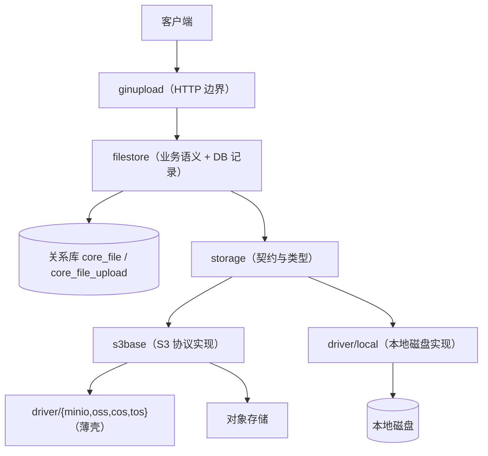
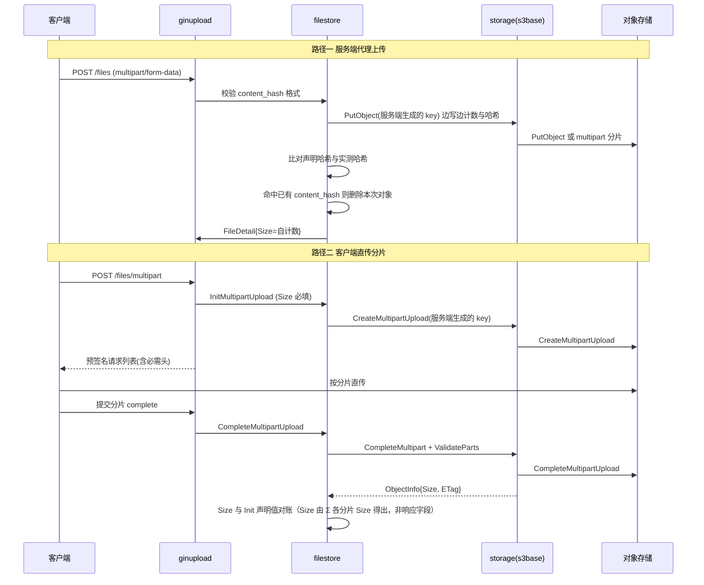

# S3 协议实现与适配层重构技术方案

> 档位：标准档 ｜ 场景：**S3 结构重构**（补充 S2 影响面/回归义务、S5 死代码下线义务）｜ 专题：架构设计、API 设计（轻量叠加 性能与容量、安全）

## 背景与目标

### 业务背景与现状

`golib` 的存储能力分四层，S3 相关代码集中在其中三层：

| 层 | 位置 | 现状职责 |
|---|---|---|
| 契约层 | `storage/` | `Storage` = `Base` + `Multipart` + `Ext` 接口；`ObjectInfo` / `PutObjectResult` / `Config` / `PathBuilder` |
| 协议层 | `storage/driver/s3base/` | 基于 `aws-sdk-go-v2/service/s3` 的统一 S3 实现（522 行），含 `PutObject` / `ListObjects` / `CopyObject` / 预签名 / 错误包装 |
| 供应商层 | `storage/driver/{minio,oss,tos,cos}/` | `minio`/`oss`/`tos` 各 26–27 行（仅 `PathBuilder` 的 `URLStyle` 差异）；`cos` 91 行（额外挂 Content-MD5 中间件与 `x-cos-forbid-overwrite`） |
| 业务层 | `filestore/` | 内容寻址去重、暂存对象生命周期、DB 记录（`core_file` / `core_file_upload`）、预签名签发 |
| HTTP 边界 | `biz/gserver/ginupload/` | 流式上传、分片上传编排、预签名消费端点（仅 local 注册） |

关键数据流（现状）：



**消费方盘点（破坏性重构的爆炸半径）**：`storage` 包的生产消费方只有 **2 个包** —— `filestore`（5 个文件）与 `biz/gserver/ginupload`（2 个文件），外加测试辅助 `internal/testutil`；`filestore` 的生产消费方只有 `ginupload`（4 个文件）。这决定了本次可以安全地做破坏性调整。

### 痛点分析

痛点全部可追溯到**四个结构性根因**，而非 20 个独立缺陷：

| 根因 | 说明 | 具体症状（含代码位置） |
|---|---|---|
| **R1 抽象比协议窄** | 接口只表达"最小可用集合"，把 S3 白送的信息（Size / ETag / Checksum / VersionID / RequestID / Region）丢在驱动内部 | ① `PutObject` 返回的 `Size` 恒为 0（`s3base/s3driver.go:156`）；② `ListObjects` 的 ETag 带引号而 `Get`/`Head` 不带（`:282` vs `:193`/`:407`）；③ `CompleteMultipartUpload` 只回 `error`，丢弃响应里的 ETag |
| **R2 供应商差异靠 `if` 与硬编码，而非数据** | 能力差异没有声明位，不支持时静默降级 | ① `IfNotExists` 在不支持条件写的后端会**静默覆盖**（`:138-140`）；② 无 SSE 能力；③ `myqcloud` 硬编码在共享 base（`:104-114`）、COS 域名模板硬编码在通用 `storage` 包（`storage/path.go:119`）；④ `cos/driver.go:59` 的 `usePathStyle` 是死代码 |
| **R3 无不变量、无测试接缝** | `s3base.New` 自建 client，请求构造逻辑不可单测；契约套件不断言 Size/ETag | 上述"静默错误"能在测试全绿的情况下长期存活 |
| **R4 预签名只返回 URL** | 而 S3 的预签名本质是"方法 + URL + **必须原样发送的头** + 过期时间" | aws-sdk-go-v2 的 `RequiredSignedHeaders` 白名单（`aws/signer/internal/v4/headers.go:17-63`）含 `Content-Type`/`Content-Md5`/`X-Amz-Meta-*`，这些头**留在 `X-Amz-SignedHeaders` 中**，客户端少发一个即 `SignatureDoesNotMatch`；而 local 后端的 token 完全不涉及 HTTP 头（`driver/local/presign.go:57-63`），两个后端的调用契约不同 |

**阻断级缺陷（必须修，属于数据正确性）**：S3 部署下 `PutObject` 的 `Size` 恒为 0。证据链：SDK `PutObjectOutput.Size` 的文档明确写"只在向 Amazon S3 Express One Zone 目录桶的追加（append）场景出现"（`service/s3@v1.101.0/api_op_PutObject.go:906-910`）→ `aws.ToInt64(nil) == 0` → `filestore/stage.go:40` 的 `Size: res.Size` 采信为 0 → `ginupload/upload_handler.go:129` 透传 → `filestore/filestore.go:114-131` 落库 `core_file.size = 0` → 详情接口返回 `"size": 0`。local 驱动用自计数 `written`（`local/driver.go:152-153,181,200`），所以**只有 S3 系后端会错**。

**安全缺陷（必须修）**：分片上传的对象存储 key 由**客户端指定**。`ginupload/dto.go:57` 暴露 `storage_path`，`handleCreateMultipartUpload` 未做任何校验即透传（`upload_handler.go`），`filestore.InitMultipartUpload` 直接用其创建分片会话与落库（`filestore/filestore.go:387,391`）。驱动层的 `pathcheck.ValidateKey` 只拒绝 `..`、前导 `/`、`//`（`storage/driver/internal/pathcheck/pathcheck.go:26-39`）。因此客户端可指定任意 key，从而覆盖他人对象，或让两份不同内容声明同一 `content_hash` 指向同一 key。

### 目标与非目标

**目标**

1. 消除"同一接口、不同后端语义分叉"：`Size`、`ETag`、Range、错误分类在所有后端**语义一致且由契约测试锁定**。
2. 把供应商差异从代码分支变为**声明式数据**，使新增一个 S3 兼容后端只需填一张表。
3. 让"不支持的能力"**显式失败或显式降级**，不允许静默失效。
4. 补齐 S3 协议适配的关键缺口：region 发现、错误上下文保留、分片约束校验、批量删除上限、大对象自动分片、预签名必需头透传。
5. 建立**可拦截参数构造错误的测试接缝**与**驱动无关的契约套件**。

**非目标（超出范畴的用例）**

| 不做的事 | 原因 |
|---|---|
| 不实现 S3 协议**服务端**（不做 S3 网关 / 兼容层） | 本方案只覆盖客户端与预签名消费端；自建 S3 网关是独立立项 |
| 不提供 bucket 级操作（`CreateBucket`/`DeleteBucket`/`ListBuckets`/ACL/Policy） | 桶由基础设施预置；引入桶生命周期管理会牵扯权限模型，本期不做 |
| 不改动 HTTP 层"业务错误返回 200 + envelope code"的全局约定 | 该约定由 `gincontext.Fail`（`biz/gcontext/gincontext/render.go:40-43`）承载，被**全公司所有服务**复用，不属于存储层范畴；见开放问题 Q13 |
| 不做 SSE-KMS 的密钥管理与轮转设计 | 只打通协议字段与配置入口；密钥治理需独立方案（开放问题 Q6） |
| 不接入具体监控/告警后端 | 只提供埋点钩子与统一的 `S3Error` 上下文；指标落地由使用方接入（开放问题 Q7） |
| 不做 access_log 脱敏与 body 采集收敛 | 涉及共享中间件 `biz/gmiddleware/ginmiddleware/access_log.go`，影响所有服务（开放问题 Q8） |
| 不做跨后端复制/迁移工具 | 无此需求；`CopyObject` 明确限定同后端（`storage/types.go` 已有 `ErrCrossBackend`） |

### 约束与非功能需求

**技术约束**

- Go 1.26.1（现有 `go.mod`），`context.WithoutCancel`、泛型均可用。
- 允许新增依赖：`github.com/aws/aws-sdk-go-v2/feature/s3/manager` 与 `.../credentials/stscreds`（两者已在本地 module cache：`manager@v1.15.15`、`credentials@v1.19.16`）。
- 后端范围：内网 S3 兼容存储（MinIO / OSS / COS / TOS）为主；**真实 AWS S3 只要求可连通**，不承诺 IRSA 与 SSE-KMS 的验收。

**规模假设（待验证，若假设不成立见对应应对）**

| 维度 | 假设值 | 口径 / 来源 | 不成立时的应对 |
|---|---|---|---|
| 单文件体积 | P99 ≈ 100 MB，上限 5 GiB | 产品口径（本次确认） | 若上限 > 5 GiB，自动分片阈值与 `MaxParts` 需重算（见「性能与容量」） |
| 并发上传数 | 50 | 产品口径 | 若达数百，峰值 in-flight 连接数线性放大，需上调 `MaxIdleConnsPerHost` 并评估分片并发下调 |
| 分片并发 | 5 / 上传 | `manager.DefaultUploadConcurrency` 为 5，作为默认值 | 由 minio 压测回填（开放问题 Q4） |
| 日均写入量 | 100 GB/天 | 产品口径 | 若达 TB/天，需重新评估 stage→promote 的二次拷贝成本（方案 C 已消除） |

**量化目标**

| 指标 | 目标 | 口径 | 推导 |
|---|---|---|---|
| 上传接口成功率 | 瞬时失败被重试吸收后 ≥ 99.9% | 服务端 2xx 且落库成功 / 总请求，**排除相关性停机窗口** | 见下方「失败模式与对策」；不含相关性停机，后者无降级手段 |
| `Size` 正确性 | 100% | `core_file.size` 等于实际写入字节数 | 契约套件断言，抽样 100 次 |
| 单次上传额外 IO | 0 字节（S3 服务端侧） | 除写入对象本身外的服务端拷贝字节数 | 方案 C 消除 `CopyObject` 提升（local 本就为 `os.Link`） |
| 峰值出站连接数 | ≤ 256 | 同一对象存储 host 的并发 TCP 连接数 | 50 上传 × 5 分片并发 = 250，向上取整到 2 的幂 |

**失败模式与对策：瞬时失败 vs 相关性停机**

这两类失败必须分开讨论 —— **重试只对前者有效**。早期版本的本文档曾把两者混为一谈，用一个串联可用性乘积去论证"所以必须重试"；该推导已废弃：相关性停机窗口内每次尝试都会失败，重试买不到任何东西。

| 失败类型 | 典型表现 | 对策 | 效果 |
|---|---|---|---|
| **瞬时失败**（非相关） | 连接重置、单节点 5xx、`SlowDown`、`RequestTimeout` | SDK 内置重试：指数退避 + 抖动，默认 3 次尝试（可配） | 单次失败率 p → ≈ pⁿ；这是重试唯一能买到的东西 |
| **相关性停机**（相关） | 对象存储整体不可用、关系库主库故障 | **无降级手段** —— 写路径无法接受"上传成功但未落库"，只能快速失败 + 明确错误；冗余需独立立项 | 重试无效：停机窗口内每次尝试都失败 |

现状事实（已核实）：`retry.DefaultMaxAttempts = 3`（`aws/retry/standard.go:29`，`MaxAttempts` 为 0 时回落，见 `:209`），且 golib 未设置任何 `Retryer`（全仓 grep 为空）。**因此重试本来就是开启的。** `Config.MaxRetries`（`storage/config.go:36`）的害处不是"缺少重试"，而是**一个名为 `MaxRetries` 的字段静默无效**：运维将其设为 5 会以为生效，实际仍是 3 次尝试。且该命名沿用 SDK v1 语义（v1 的 `maxRetries=3` 意为 4 次尝试），在 v2 中对应的是 `RetryMaxAttempts`（3 次**尝试**），名字本身就是错的。

**决策**：实现 `Config.Retry`（`MaxAttempts` + `Mode`）并使其真实生效，理由是**配置契约必须诚实**，以及让 `OpError.Retryable()` 为调用方提供判断依据 —— 而非"挽救可用性"。**本期不承诺端到端可用性目标**（无 SLA、开发阶段、内网自建存储）；相关性停机显式登记为已知单点并给出 RTO，见开放问题 Q2。

重试要求逐接口幂等性：

| 操作 | S3 幂等性 | 结论 |
|---|---|---|
| `PutObject`（同 bucket+key） | 幂等（覆盖写） | 可安全重试 |
| `UploadPart`（同 upload_id + part number） | 幂等（覆盖分片） | 可安全重试 |
| `CompleteMultipartUpload` | 幂等 | 可安全重试 |
| `DeleteObject` | 幂等（不存在也返回 204） | 可安全重试 |
| `CreateMultipartUpload` | **非幂等**（每次生成新 `upload_id`） | 重试会泄漏分片会话，必须引入幂等键 |

### 验收标准

| 验收项 | 阈值 / 判据 | 验证方式 | 责任方 |
|---|---|---|---|
| S3 流式上传落库 size 正确 | 抽样 100 次全部 `core_file.size == 实际字节数` | 契约套件 `PutGet` 用例（含 `res.Size` 断言）+ minio 集成 | 开发 |
| 契约套件全绿 | 全部 driver × 全部不变量断言通过 | `go test ./storage/... ./internal/testutil/...`（含 minio） | CI |
| 请求构造正确性 | 每个 driver 的 input 构造有零网络单测覆盖 | `go test ./storage/driver/s3base/...`（fake `S3API`） | 开发 |
| 旧行为不回归 | 现有 `filestore` / `ginupload` 测试用例 100% 通过 | `go test ./...` | CI |
| 结构差异受控 | `storage` 包新增/变更/删除符号逐条评审确认，差异项有记录 | 评审记录 | 评审人 |
| 死代码 / 死配置下线 | 全仓 grep 零引用且编译通过 | `go build ./...` + 评审 | 评审人 |
| 预签名闭环 | 生成的 `PresignedRequest`（含必需头）可被真实后端接受 | minio 上端到端用例 | CI |
| 安全 | `storage_path` 不再可由客户端影响对象 key | 代码评审 + 恶意入参用例 | 评审人 |

---

## 方案设计

### 总体思路

一句话：**把"协议给的事实"如实返回，把"供应商的差异"变成数据，把"驱动必须遵守的不变量"写成测试。** 具体三条主线：

1. **契约如实**：`storage` 包的返回类型承载 S3 已经免费给出的字段（Size / ETag / Checksum / VersionID / StorageClass / RequestID），并声明各后端的硬限制与能力（`Caps`）。上层不再需要"推断"或"再查一次"。
2. **差异数据化**：`s3base` 退化为纯协议实现，供应商差异收敛为 `ProviderProfile` 数据表；`storage` 包不得出现任何供应商名字。
3. **不变量可验证**：所有"驱动必须做到"的事（Size 不得采信响应、ETag 必须规范化、批量删除必须遵守后端上限、预签名必须回传必需头）都由契约套件断言，且参数构造逻辑可通过注入 fake client 做零网络单测。

### 总体架构

分层与数据所有权：

| 模块 | 职责 | 数据所有权 | 不得做的事 |
|---|---|---|---|
| `storage`（契约层） | 接口、类型、错误分类表、能力与限制声明、跨驱动共享校验（分片校验、批量删除分批、TTL 归一） | 无持久状态 | 不得出现供应商名、不得含 IO 实现 |
| `storage/driver/s3base` | S3 协议：请求构造、签名、分片、错误分类、字节计数、region 解析、重试与连接池 | 仅进程内缓存（bucket→region） | 不得出现供应商特有分支 |
| `storage/driver/<provider>` | 声明 `ProviderProfile`（路径风格、域名模板、条件写模式、region 策略、限制、私有中间件） | 无 | 不得承载业务逻辑 |
| `storage/driver/local` | 本地磁盘实现（原子写、分片会话、HMAC 预签名 token） | `baseDir` 下的 `data/`、`meta/`、`.multipart/` | 不得越出 `baseDir` |
| `filestore` | 内容去重、上传生命周期、`core_file` / `core_file_upload` 读写、预签名签发 | **DB 两张表由本层独占写**，其它层只读 | 不得直连 SDK |
| `biz/gserver/ginupload` | HTTP 绑定、参数校验、状态码映射 | 无 | 不得绕过 `filestore` 直连 driver |

**单点与故障域**：对象存储与关系库均为外部单点，写路径**无降级手段**（无法接受"上传成功但未落库"），因此策略是"快速失败 + 重试 + 明确错误"，而不是降级。应用进程自身无状态，可水平扩展；`local` 驱动要求 `baseDir` 独占（进程内锁无法跨实例生效），这一点必须在配置文档中显式声明。

**调用链深度与重试**：`client → ginupload → filestore → (DB 1 写 + n 读) → storage → 对象存储（1 ~ 1024 次请求）`。重试必须配退避（SDK 内置指数退避 + 抖动）与幂等（见上表）；`CreateMultipartUpload` 的非幂等性由幂等键处理（见「关键逻辑」）。

### 核心流程



两条路径的关键差异（必须在实现中显式处理）：路径一服务端能看到全部字节，可实测哈希；路径二服务端**看不到字节**，只能采信客户端声明的 `content_hash` 与 `size`，因此必须（a）在 `complete` 时做 Size 对账并拒绝不一致，（b）对象 key 由服务端生成，使客户端无法指定对象位置。

**对 (a) 的精确表述（实施期修正）**：对账的左手边是 `Σ parts[i].Size`（**完成请求里各分片的大小之和**），不是"服务端返回的真实 Size" —— 已核实 `CompleteMultipartUploadOutput` 没有 `Size` 字段（修正记录 C-3）。因此这条控制抓的是"客户端在两个请求点声明不一致"，**抓不住"客户端两处一致地撒谎"**。真正的强校验是 `ChecksumType=FULL_OBJECT`，见"客户端直传路径的对账"。

### 备选方案与取舍

#### 决策一：存储 key 与内容哈希是否解耦

| 方案 | 做法 | 代价 | 不该选的场景 |
|---|---|---|---|
| **A（现状）** | key = 内容 SHA256；先写暂存对象，校验后 `CopyObject` 提升为最终 key | 路径二下服务端看不到字节，key 只能来自**客户端声明**的哈希；S3 上另有一次额外全量服务端拷贝（local 走 `os.Link`，此项对其无意义）；暂存对象需 `CleanupStagedObjects` 兜底 | 当"对象 key 必须能被外部系统按内容验证或寻址"是硬需求时（此时 C 的代价不可接受）；或上传全部经服务端代理因而哈希可验证、且规模很小 |
| **B** | 保持 key = 哈希，但用 multipart 替代暂存：分片直写，`complete` 时才可见，哈希不匹配则 `abort` | 需在 `CreateMultipartUpload` 时就知道最终 key —— 而 key 依赖尚未读完的内容哈希，**逻辑上不成立**（除非采信客户端声明值，那正是 A 的缺陷） | — |
| **C（推荐）** | **key 由服务端生成**（如 `objects/{uuid}`），去重是 **DB 层**职责（`core_file.content_hash` 唯一索引）；小文件内存直写、大文件 multipart 直写 | 改变 `storage_uri` 的含义（对外不透明，但需回归）；路径二下若去重竞争命中会留下一个未被引用的对象，需 GC 兜底 | 见 A 行同列：需要把内容寻址暴露给外部系统时 |

**为什么选 C**（按决定性排序。早期版本的本文档以"安全 + 省一次拷贝"为主要理由，二者单独都不足以支撑结论，已更正）：

1. **协议约束（决定性）**：路径二下服务端从头到尾看不到字节，**内容哈希在新对象被命名之前永远无法验证**。于是"key = 哈希"图穷：要么让未经校验的客户端声明值决定对象落点（攻击者可声明受害者文件的哈希以覆盖其对象），要么在 `complete` 之后把整个对象读回重算哈希（日均 100 GB 的额外读，比它本想省掉的拷贝更贵）。**C 是唯一让客户端无法影响对象落点的方案**，且把写入压到一次。
2. **结构性简化**：C 不是"维护"暂存子系统，而是**删掉它** —— `StageObject`、`DiscardObject`、`CommitStagedObject` 的 promote、`CleanupStagedObjects`、`sweepExpired` 整条生命周期，连同"清理必须使用未取消 ctx"这类时序缺陷（`ginupload/upload_handler.go:54-58` 正是此类）一并消失。不变量随之简化：对象落盘后 key 不再变化，引用关系只由 DB 表达。
3. **性能**：S3 后端省去一次全量服务端拷贝；local 走 `os.Link`，此项对其无意义，因此只值一票。

**已权衡的反方论据**（不能省略，否则决策不完整）：

- C 在路径二的去重竞争下会产生未被引用的对象，需要 GC。但 **A 同样需要 GC**（崩溃的暂存对象即垃圾，故已有 `CleanupExpired`/`sweepExpired`），且 C 的 GC 更容易证明正确 —— 它是引用式的（扫对象、查 DB、超期即删），而非基于一个并行会话存储的 TTL。
- A 另有一个 C 不具备的优点：内容寻址在竞争下自愈（两份相同内容撞同一 key 无害）。但该性质在路径二上因哈希不可验证而**失效** —— 恰在最需要它的地方不成立；而在哈希可验证的路径一上，A 仍要付 stage + copy 的成本。

**改判条件（可证伪）**：当"对象 key 必须能被外部系统按内容验证或寻址"成为真实需求（下游按 key 校验内容、缓存层必须以内容哈希为 key）时，A 值得重新考虑。这是产品约束，不是技术权衡。

#### 决策二：供应商差异的表达方式

| 方案 | 代价 | 不该选的场景 |
|---|---|---|
| **A（现状）**：base 里硬编码判断 + provider 薄壳 | 每加一个后端都要改 base；共享包里出现供应商域名；能力缺失只能静默 | — |
| **B（推荐）**：`ProviderProfile` 数据表，provider 只声明数据 | 需要一次性设计好 profile 的字段集合，漏字段时仍需改 base | 若只有 1 个后端且永不扩展，则过度设计 |
| **C**：每个后端完全独立实现 | 5 份重复的签名/分片/错误处理代码，修复需改 5 处 | 后端语义差异极大的场景（如 S3 与 FTP 这类跨协议对象） |

选 B。判定依据：`minio`/`oss`/`tos` 三个后端的现有差异**只有 `URLStyle` 一个字段**（各 26–27 行），说明它们本质同构；`cos` 的差异也只有 2 处（Content-MD5 中间件、`x-cos-forbid-overwrite`）。差异量小但位置分散，正是数据表的适用场景。

#### 决策三：大对象上传能力自研还是引入官方 manager

| 方案 | 代价 | 不该选的场景 |
|---|---|---|
| **A**：自研并发分片 | 需自行处理并发、重试、part 编号、10000 分片上限、`EntityTooSmall` 预校验，约 300–500 行且易错 | 团队有强诉求控制每一个请求时才值得 |
| **B（推荐）**：引入 `feature/s3/manager` | 新增一个依赖（已在本地 cache，`v1.15.15`）；其 `Uploader` 的默认参数需按本方案规模覆盖 | 若禁止新增依赖，则只能选 A |
| **C**：限制单文件 ≤ 5 GiB 单次 PUT，不提供分片 | 放弃大文件能力；但分片能力已存在（`/files/multipart/*`），等于退回现状 | — |

选 B。`manager` 已提供本方案需要的全部约束常量：`MaxUploadParts = 10000`、`MinUploadPartSize = 5 MiB`、`DefaultUploadConcurrency = 5`（`feature/s3/manager@v1.15.15/upload.go:25-37`），以及 region 发现 `GetBucketRegion`（`bucket_region.go:63`）。

### 技术选型与理由

| 选型 | 结论 | 理由 | 代价 |
|---|---|---|---|
| S3 客户端 | 继续用 `aws-sdk-go-v2/service/s3` | 已用，且 v2 提供了 `RequiredSignedHeaders` 等精确语义 | 与 v1 的 `s3manager` 生态不同，需用 `feature/s3/manager` |
| 并发分片 | `feature/s3/manager` | 见决策三 | 新增依赖 |
| region 发现 | `manager.GetBucketRegion` + 进程内缓存 | 与 filestash 的 `GetBucketLocation` 缓存做法等价（`plg_backend_s3/utils.go:57-77`），但复用官方实现 | 首次访问需一次额外 HEAD 请求 |
| 凭证链 | 静态密钥 + `stscreds` AssumeRole / WebIdentity，缺省回落 SDK default chain | 支持 IRSA/实例角色，摆脱硬编码 AK/SK；filestash 已有等价能力（`plg_backend_s3/index.go:53-75`） | 需处理凭证刷新失败的可观测性 |
| 错误模型 | sentinel + `OpError` 双层 | `errors.Is` 向后兼容，同时保留 `Code`/`RequestID`/`Op` | 多一层类型 |
| 测试接缝 | 注入 `S3API` 接口 + minio 契约套件 | 见「验证手段」 | 需抽象 API 子集 |

---

## 详细设计

### 模块划分与职责

见「总体架构」的职责表。数据所有权的硬边界：**`core_file` / `core_file_upload` 只允许 `filestore` 写**；对象存储的 key 空间由 `storage` 决定，`filestore` 通过 `StoragePath` 间接持有而不自行拼接（现状 `filestore.buildStorageURI` 拼 `s3://bucket/key` 字符串，新方案下 key 由 driver 生成后返回，`filestore` 只存储不解释）。

### 存储层接口设计

**接口清单**（示意，字段含契约含义）：

```go
// 能力与硬限制：由 driver 声明，上层据此决定降级或拒绝，而不是静默尝试
type Caps struct {
    ConditionalWrite ConditionalWriteMode // None | NativeIfNoneMatch | VendorHeader | ReadThenWrite
    Multipart, ListParts, ServerSideCopy  bool
    PresignPut, PresignPart, PresignGet   bool
    Versioning, ByteRange                 bool
    SSE                                   SSEModes
    Limits                                Limits
}

type Limits struct {
    MaxSinglePut   int64 // S3: 5 GiB      local: 0（无限制）
    MinPartSize    int64 // S3: 5 MiB      local: 0
    MaxParts       int   // S3: 10000      local: 0
    MaxDeleteBatch int   // S3: 1000       local: 0
    MaxListPage    int32 // S3: 1000       local: 0
}

// 结果类型：不变量写在注释里，并由契约套件断言
type ObjectInfo struct {
    Bucket, Key   string
    Size          int64     // 恒为整对象字节数，且由客户端计数得出，不采信服务端响应
    ETag          string    // 规范化：无引号；单次 PUT 为 32 位 hex
    ContentType   string
    LastModified  time.Time // 恒为 UTC；来自服务端，不伪造
    Metadata      map[string]string
    StorageClass  string
    Archived      bool      // 需 restore 才能读（Glacier 等）
    Checksum      *Checksum
    VersionID     string
}

type GetObjectResult struct {
    Body   io.ReadCloser
    Info   ObjectInfo
    Range  *RangeInfo  // 非 nil 表示 Body 仅是该段；Info.Size 仍为整对象大小
    Verify func() error
}

// 预签名返回"请求"而非字符串：客户端必须原样发送 Headers
type PresignedRequest struct {
    Method    string
    URL       string
    Headers   http.Header
    ExpiresAt time.Time
}

type Multipart interface {
    CreateMultipart(ctx context.Context, bucket, key string, in CreateMultipartInput) (string, error)
    UploadPart(ctx context.Context, ref MultipartRef, number int32, body io.Reader) (*PartInfo, error)
    ListParts(ctx context.Context, ref MultipartRef, opts ...ListPartsOption) (*ListPartsOutput, error)
    CompleteMultipart(ctx context.Context, ref MultipartRef, parts []PartInfo) (*ObjectInfo, error)
    AbortMultipart(ctx context.Context, ref MultipartRef) error
}
```

设计取舍说明：

- **`CreateMultipartInput` 用结构体而非 `...PutOption`**：变参 option 允许实现"解析了却不用"，正是分片上传静默丢弃 `Metadata`/`StorageClass` 的成因（`s3base/s3driver.go:310-318`）。结构体 + 统一转换强制穷尽。
- **`ListParts` 为新增能力**：客户端崩溃后无法得知服务端已有分片是当前的真实缺口；对标 filestash TUS 用 `HEAD` 返回 `Upload-Offset`（`handler_save.go:136-148`）。
- **`ListParts` 返回 `*ListPartsOutput` 而非 `[]PartInfo`**（实施期修正）：S3 一次最多返回 1000 片而上限是 10000 片，若签名是 `[]PartInfo` 就**没有地方承载 `IsTruncated`/`NextPartNumberMarker`**，1000 片以上的上传会静默丢数据。分页信封是协议事实，必须出现在签名里。
- **`CompleteMultipart` 返回 `*ObjectInfo`**：S3 的 complete 响应本就带 ETag 与 Location，丢弃它导致上层必须再发一次 `HeadObject`。但**该响应不含 `Size` 与 `LastModified`**（实施期修正），因此 `CompleteMultipart` 返回的 `ObjectInfo.Size` 是由传入 `parts` 求和得出的，而**不是**从响应里读到的 —— 见下文"Size 的唯一来源"。
- **`GetObjectResult.Range` 与 `Info.Size` 分离**：现状 `s3base` 在 Range 时返回段长度（`:192` 取 `ContentLength`），而 `local` 返回整对象大小（`local/driver.go:241-251`），同一调用两个语义 —— 新契约必须钉死一个。实现取"整对象大小"：S3 在 206 响应的 `Content-Range: bytes s-e/total` 里给出 total，`local` 本就有整对象大小。
- **`GetObjectResult.Range` 与 `Info.Size` 分离**：现状 `s3base` 在 Range 时返回段长度（`:192` 取 `ContentLength`），而 `local` 返回整对象大小（`local/driver.go:241-251`），同一调用两个语义 —— 新契约必须钉死一个。

**错误码约定**：对外 HTTP 状态码由 `ginupload` 决定（存储协议端点用语义化状态码，业务端点沿用 envelope 约定）；存储层只负责把后端错误分类到 `Kind`。

```go
type OpError struct {
    Driver, Op, Bucket, Key string
    Kind      Kind   // KindNotFound / KindNoSuchBucket / KindAlreadyExists / KindPermission /
                     // KindInvalidArgument / KindRangeNotSatisfiable / KindArchived /
                     // KindThrottled / KindUnsupported / KindPreconditionFailed
    Code      string // S3 ErrorCode 原样保留
    Status    int
    RequestID string // x-amz-request-id
    Err       error
}
func (e *OpError) Unwrap() error   // 按 Kind 返回对应 sentinel，保持 errors.Is 兼容
func (e *OpError) Retryable() bool
```

分类只写一张表（`codeTable`），**禁止子串匹配**：现状 `isAlreadyExistsErr` 用 `strings.Contains(msg, "412")`/`"409"`/`"304"`（`s3base/errors.go:48-51`）会误判含这些数字的 request id 或字节数，且把 `304 NotModified`（条件 GET 响应）误归为"对象已存在"（条件 PUT 失败应为 412）。

**鉴权**：存储层使用静态密钥或 AssumeRole 凭证，不做用户级鉴权；越权防护在 `ginupload` 的认证中间件与对象 key 归属（服务端生成）两层。

**幂等**：见「约束与非功能需求」的幂等性表。`POST /files/multipart`（`CreateMultipartUpload` 非幂等）需引入幂等键：以 `hash(content_hash + name + 调用方标识)` 作为会话键，重复调用返回同一 `upload_id`；实现上可用 DB 唯一索引或进程内 + DB 双检。

**规模上界**（全部来自协议事实，必须在实现中作为常量并校验）：

| 上界 | 值 | 来源 |
|---|---|---|
| 单次 POST/PUT 对象体积 | 5 GiB | S3 PutObject 限制 |
| 单分片体积 | 5 MiB ~ 5 GiB | S3 UploadPart 限制 |
| 分片数 | 1 ~ 10000 | S3 Multipart 限制 |
| 单次 DeleteObjects 批量 | 1000 | S3 DeleteObjects 限制 |
| 单次 ListObjectsV2 页大小 | 1000 | S3 限制 |
| 预签名有效期 | ≤ 7 天（604800 s） | SigV4 `X-Amz-Expires` |
| 对象总体积 | 5 TiB | S3 Multipart 限制 |

**本次不开放的接口能力**：不做对象级 ACL、不暴露 `VersionId` 选择读、不提供 `CopyObject` 跨后端、不做服务端加密信封封装（只透传 `SSEConfig`）。

### 错误模型

（见上节 `OpError`）关键点：分类表以 `smithy.APIError.ErrorCode()` 为主键、`ResponseError.HTTPStatusCode()` 为佐证，并把 301 `PermanentRedirect`（触发 region 缓存失效 + 一次重试）、412 `PreconditionFailed`、416 `InvalidRange`、429/503 `SlowDown`（标记 `Retryable`）从"generic error"中拆出来。

### 供应商适配：ProviderProfile

```go
type ProviderProfile struct {
    Name              string
    ForcePathStyle    bool
    ConditionalWrite  ConditionalWriteMode
    ConditionalWriteOption func(*s3.Options)             // VendorHeader 模式注入，如 COS 的 forbid-overwrite
    S3Options         []func(*s3.Options)                 // 供应商固有的 client 级覆盖，如 OSS 的 RequestChecksumCalculation
    Limits            storage.Limits
    APIOptions        []func(*middleware.Stack) error     // 供应商私有中间件
}
```

**与初稿的差异（实施期修正）**：初稿还列了 `VirtualHostedHost` / `Region` / `RegionFromEndpoint` / `SSE` 四项，实现时全部**不纳入本期**，理由分别是：虚拟托管与 region 推导属于"对外 URL 渲染"与"连接建立"，`storage` 层已由 `PathBuilder` 与 SDK 的 `config.LoadDefaultConfig` 承担，放进 profile 会造成两处配置同一件事；`SSE` 本期只透传配置不做信封封装（见"本次不开放的接口能力"与开放问题 Q6），未验证的能力位留在 `Caps` 里会变成"声明了但没人测"的假承诺。**宁可窄而真，不可宽而虚**。能力矩阵中 `SSE` 一列因此整列标注为"本期不实现"。

供应商能力矩阵（实现时按实测回填，**未实测项标"待验证"**）：

| 能力 | MinIO | OSS | COS | TOS | local |
|---|---|---|---|---|---|
| 路径风格（`ForcePathStyle`） | **PathStyle，已实测**（真实端点 `s3.i.yygu.cn:58081` 上 15 项契约套件全绿） | **VirtualHosted，已实测**（path-style 回 403 `SecondLevelDomainForbidden`） | VirtualHosted | **VirtualHosted，已实测**（path-style 回 403 `InvalidPathAccess`；原声明 `PathStyle` 在真机上 100% 请求被拒） | n/a |
| 条件写模式（`ConditionalWrite`） | **NativeIfNoneMatch，已实测**（`If-None-Match:*` 生效，套件条件写用例通过） | **VendorHeader，已实测**（`x-oss-forbid-overwrite`；`If-None-Match:*` 回 400 `NotImplemented`） | **VendorHeader，已实测**（`x-cos-forbid-overwrite`） | **NativeIfNoneMatch，已实测**（`If-None-Match:*` 生效，契约套件条件写用例通过） | 进程内锁（原生保证） |
| 条件写冲突的错误码映射（`ErrorCodeKind`） | 不需要（**已实测**：`PreconditionFailed` 走基类表→`ErrAlreadyExists`） | **已实测**：`FileAlreadyExists`→`ErrAlreadyExists`（409） | **已实测**：`FileAlreadyExists`→`ErrAlreadyExists`（409） | 不需要（**已实测**：`PreconditionFailed` 走基类表→`ErrAlreadyExists`） | 不需要 |
| 请求校验和（`RequestChecksumCalculation`） | **已实测兼容**（沿用 SDK 默认 `when_supported`，Put/Get/分片均成功） | **已实测不支持 aws-chunked**，须降为 `when_required`（否则 PutObject 回 400 `NotImplemented`） | **已实测兼容**（沿用 SDK 默认 `when_supported`，aws-chunked 可用） | **已实测兼容**（沿用 SDK 默认 `when_supported`，Put/Get/分片均成功） | n/a |
| `DeleteObjects` 前置校验和 | 不需要（**已实测**：未加中间件，1001 key 分批删除通过） | **已实测需要 `Content-MD5`**（否则回 400 `MissingArgument`） | **已实测需要 `Content-MD5`** | 不需要（**已实测**：未加中间件，1001 key 分批删除通过） | 不需要 |
| `MinPartSize` | 5 MiB（**已实测可上传**，下限边界未探） | **100 KB，已实测**（OSS 非末分片下限即 100 KB） | **1 MiB，已实测**（文档写"1MB"，但 1,000,000 字节被 `EntityTooSmall` 拒绝，1,048,576 通过） | **4 MiB，已实测**（4,194,303 字节被 `EntityTooSmall` 拒绝，4,194,304 通过；1/2/3 MiB 同样被拒） | 0（无限制） |
| `MaxDeleteBatch` | 1000（**已实测**：1001 个 key 的分批删除通过） | 1000（**已实测**：1001 个 key 的分批删除通过） | 1000（**已实测**：1001 个 key 的分批删除通过，85.8s） | 1000（**已实测**：1001 个 key 的分批删除通过，41.3s） | 0（无限制） |
| 预签名 GET/PUT 回环 | **已实测通过**（path-style + 带端口的 host，SigV4 签名被接受） | **已实测通过** | **已实测通过**（COS 接受 SigV4 预签名，而非自有的 q-sign） | **已实测通过**（SigV4 预签名 GET/PUT 回环，见 `tos/presign_live_test.go`） | 进程内 HMAC |
| 预签名分片直传（`PresignPart`） | **已实测通过**（`STORAGE_SUITE_BULK=1` 下 5 MiB 分片：预签名 PUT → 参与 complete → 读回） | **已实测通过**（契约套件断言"分片签名 ≠ 整对象签名"，live 回环默认跑 100 KB 分片） | **已实测通过**（live 回环默认跑 1 MiB 分片） | **已实测通过**（`STORAGE_SUITE_BULK=1` 下跑 4 MiB 分片） | 仅签名形状（URL 指向业务服务，套件里无服务可打） |
| 服务端拷贝（`CopyObject`） | **已实测通过**（契约套件新增用例，源 key 含空格与 `+`，验证 `x-amz-copy-source` 转义） | **已实测通过**（同上） | **已实测通过**（同上） | **已实测通过**（同上） | **已实测通过**（硬链接实现） |
| 虚拟托管域名模板 / region 策略 | 不纳入本期 | 不纳入本期 | 不纳入本期 | 不纳入本期 | n/a |
| SSE | 本期不实现 | 本期不实现 | 本期不实现 | 本期不实现 | n/a |

"待验证"项的处置规则已写进代码注释：尚未实测的后端在 `profile` 里注明"该声明由契约套件的条件写用例证伪"。OSS 已经走完这条证伪路径：原声明 `PathStyle` + `NativeIfNoneMatch` 在真实端点上是**全量 403/400**（不是"部分功能不可用"，而是所有请求都被拒），实测后改为 `VirtualHosted` + `VendorHeader`。**声明值与证伪手段成对出现**，不留无法检验的断言。

**COS 条件写：一次"看起来已实测"的错误结论。** 原 profile 声明 `x-cos-forbid-overwrite` 冲突时 COS 返回 304 NotModified，并据此写了 `ErrorCodeKind`。实测（2026-09-15）发现这个结论是把两个头叠加后的产物误记成了私有头的功劳：

| 下发的头 | COS 的响应 |
|---|---|
| 只发 `x-cos-forbid-overwrite` | 409 `FileAlreadyExists`（`ErrAlreadyExists`） |
| 只发 `If-None-Match:*` | **请求成功，对象被静默覆盖** |
| 两个都发（修复前的实际请求） | 304 `NotModified` |

真正的危险在第二行：COS 对 `If-None-Match:*` **既不报错也不生效**，这正是本仓库反复强调要避免的"静默退化为覆盖写"。而修复前共享层对**所有**后端无条件下发该头，于是 COS 的条件写恰好靠"私有头 + 原生头同时在场"这种未定义组合才成立 —— 一旦哪个环节去掉原生头，条件写就会无声地退化成覆盖写，且没有任何测试会变红（契约套件只断言最终未覆盖，而它当时确实没被覆盖）。现在原生头只对声明 `NativeIfNoneMatch` 的后端下发，由 `s3base` 的零网络单测钉住。这个案例说明：**"已实测"必须记录被测的确切输入**，否则测出来的结论无法复用。

供应商差异的表达能力在实测后补了一项：`S3Options []func(*s3.Options)`。原先"供应商差异只走 `APIOptions`/`ConditionalWriteOption`"覆盖不到"客户端级配置差异"，而 OSS 的 `RequestChecksumCalculation` 恰好是这一类 —— 它不是某个操作的中间件，而是整个 client 的签名/编码行为。`S3Options` 只放**该供应商固有的**覆盖，调用方的一次性调优仍走 `WithS3Options`，两者在 `s3base.New` 里按"先固有、后调优"的顺序应用。

设计收益（**均已落地**）：`storage` 包不再出现 `myqcloud`（原先 `storage/path.go` 在通用包里硬编码 COS 域名，该代码已随死 URL API 一并删除）；`s3base` 不再出现供应商分支；`cos/driver.go` 里重复的那份 `usePathStyle` 已删除。

**TOS 真机实测（2026-09-15，`tos-s3-cn-beijing.volces.com`，bucket `sh-local-test`）**：除寻址风格（path-style 全量 403 `InvalidPathAccess` → 改 virtual-hosted）与 `MinPartSize`（实测 4 MiB，而非照抄 S3 的 5 MiB）两处**声明被真机证伪并已修正**外，契约套件 15 个子测试（含 `STORAGE_SUITE_BULK=1` 的 4 MiB 分片回环与 1001 key 分批删除）、预签名 GET/PUT 回环、预签名**分片**直传回环、`CopyObject` 均通过。**诚实边界**：`MaxSinglePut`（5 GiB）与 `MaxParts`（10000）是沿用 `S3Limits` 的未探边界，不可能靠上传 5 GiB 来验证。原先"`CopyObject`/`PresignUploadPartObject` 只有一次性探针验证、套件无回归用例"的缺口已在同批次补上（见下"共享套件新增三条用例"）。

**共享套件新增三条用例（2026-09-15）**：此前 `RunStorageSuite` 有 12 条，而 `Caps` 里的 `ServerSideCopy`/`PresignPart` 两项能力**声明了却没有断言**（只有桩与 local 的零散覆盖），特殊字符 key 也没有任何真机用例——这三处正是"声明了却没人守"的典型。补上后共 15 条：

- `CopyObject`：源 key 故意含空格与 `+`（`x-amz-copy-source` 的转义规则与请求路径不同：`+` 在查询串语义里表示空格，必须编成 `%2B`），核对内容、`ContentType` 与"源对象仍在"，并要求源不存在时报 `ErrNotFound`，而不是拷出一个空对象；
- `SpecialCharKeys`：空格、`+`、`%`、`&`/`=`、中文 key 的 Put/Get/Head 回环，外加一条**交叉断言**——只在 `+` 与空格上不同的两个 key 必须在列举里同时存在。只用"各自读回自己的内容"是发现不了 `+` ↔ 空格折叠的：两个 key 指向同一对象时各自都"自洽"；
- `PresignPart`：会话号/分片号缺失必须报 `ErrInvalidArgument`、ttl 默认值与 7 天上限，以及**分片签名结果必须不等于整对象 PUT 的签名**——签名漏绑 `uploadId`/`partNumber` 时，客户端直传的分片会静默覆盖整个对象，且全链路不报错。

三条在 local、进程内桩与真实 MinIO/OSS/COS/TOS 上全绿。`RunPresignLiveRoundTrip` 同步扩展到预签名**分片**，在 OSS（100 KB）、COS（1 MiB）、TOS（4 MiB）、MinIO（5 MiB，后两者需 `STORAGE_SUITE_BULK=1`）上验证了"预签名 PUT 分片 → 参与 `CompleteMultipart` → 读回校验"。

**关于"四后端编译通过"这条判据的诚实说明**：本条只要求编译通过。实测覆盖 MinIO（`s3.i.yygu.cn:58081`，bucket `dotpen-api-test`）、OSS（`oss-cn-beijing`，bucket `sh-local-test`）、COS（`ap-beijing`，bucket `test-ccnerf-1251908240`）与 TOS（`tos-s3-cn-beijing.volces.com`，bucket `sh-local-test`，归属地域由 `GetBucketLocation` 实测确认）四个真实端点，均跑完整契约套件（15 项）+ 预签名 GET/PUT 回环，且都开了 `STORAGE_SUITE_BULK=1` 验证分片回环、预签名分片直传与 1001 个 key 的分批删除。加上 local，实测覆盖五个端点（另有 in-process 桩覆盖 `s3base` 的协议路径）。**仍未做真机验收的只剩真实 AWS S3**（本期只要求"可连通"，见上文后端范围）。

OSS 与 COS 的实测同时说明：**未实测的声明可以错得很彻底**。OSS 的寻址风格与条件写两项声明在真机上会让 100% 的请求失败；两家的 `MinPartSize` 都照抄了 S3 的 5 MiB，而真实值分别是 100 KB 与 1 MiB，导致分片上传这条路径从未在真实端点上跑过（被套件按"体积过大"跳过）。COS 这一格尤其值得记：官方文档写的是"1MB"，实测边界却是 1 MiB（1,000,000 字节被拒），**按文档字面填会放过必然失败的请求**。因此 MinIO/TOS 接入前必须先跑一次同一套契约套件，且分片下限要按实测而非文档填。

### 关键逻辑与边界条件

**1. Size 的获得（消灭 Size=0）**

不变量：**驱动不得从响应里推断客户端已经掌握的事实。** 所有上传路径用同一个计数器得到 Size：

```go
type countingReader struct { r io.Reader; n int64 }
func (c *countingReader) Read(p []byte) (int, error) {
    n, err := c.r.Read(p)
    c.n += int64(n)
    return n, err
}
```

**Size 的唯一来源是客户端计数**：`PutObjectOutput.Size` 永不读取（对普通对象恒为 nil，仅在 S3 Express One Zone 的 append 场景才有值）；`CompleteMultipartUploadOutput` **根本没有 `Size` 与 `LastModified` 字段**（实施期修正：初稿称"分片路径的 Size 由 `CompleteMultipart` 返回的 `ObjectInfo` 提供"，经 SDK 结构体核对为误）。因此实现为：

- `PutObject` 与 `UploadPart` 在驱动内用计数 `io.Reader` 统计实际写出字节数，作为返回值；
- `CompleteMultipart` 的 `ObjectInfo.Size = Σ parts[i].Size`（调用方提供），并与 `CreateMultipartInput.Size`（若调用方声明）对账；
- 从此不再出现"上传成功但落库 size=0"，也不再为拿 Size 多发一次 `HeadObject`。

**2. 分片约束的校验时机（避免白传）**

`storage.ValidateParts(parts []PartInfo, caps Caps) error` 由所有驱动共用，在 `CompleteMultipart` 前对**完整分片清单**做终检：分片号升序且不重复、除末片外 `Size >= MinPartSize`、片数 `<= MaxParts`。另有 `ValidatePartCount` 供 `UploadPart` 做能确知的检查（分片号越界、片数超上限）。

**实施期修正**：初稿称 `ValidateParts` 在 `UploadPart` 与 `CompleteMultipart` **两处**调用，实现时发现前者不可行 —— 上传第 N 片时**无法知道它是不是末片**，而"除末片外 `Size >= MinPartSize`"恰恰依赖这个信息。S3 自身也只能在 complete 时返回 `EntityTooSmall`，这是协议事实而非实现缺陷。所以提前发现 `EntityTooSmall` 的责任落在**上层按 `MinPartSize` 切分**（`filestore` 保证每片不小于该值），而不是驱动在 `UploadPart` 时拒绝；契约套件的分片用例也按此断言（上传时只校验能校验的，complete 前校验完整清单）。

**3. 批量删除的分批**

`MaxDeleteBatch` 由 driver 声明，共享层 `DeleteObjectsChunked` 按该值分批并设置 `Quiet: true`。现状一次性提交全部 key（`s3base/s3driver.go:214-248`）在 >1000 时失败，而 `local` 逐 key 循环永不失败 —— 同一接口行为分叉。

**4. 预签名必需头透传**

`PresignedRequest.Headers` 直接由 SDK 签名结果中提取（`Content-Type`/`Content-Md5`/`X-Amz-Meta-*` 等留在 `X-Amz-SignedHeaders` 的头）。**调用方必须原样发送**，HTTP 层需把该字段透传给前端，而不是仅返回 URL。

**5. TTL 语义归一**

```go
const (
    PresignTTLDefault = 15 * time.Minute
    PresignTTLMax     = 7 * 24 * time.Hour
)
func ResolvePresignTTL(ttl time.Duration) (time.Duration, error) // 0→默认；<0→错误；>Max→错误
```

现状两个后端对 `ttl=0` 的行为相反：local 立即过期（`local/presign.go:56`），S3 默认 900 秒（SDK `api_client.go:1100-1104`）；且超 7 天是在**使用 URL 时**才报错。

**6. CopySource 编码**

`CopySource` 必须是 URL 编码值。现状直接拼 `srcBucket + "/" + srcKey`（`s3base/s3driver.go:433`），key 含 `+`（被当空格）、`#`（截断）、`%`、空格或非 ASCII 时失败。

**实施期修正（初稿被实测证伪）**：初稿写"按后端实测选择 `url.PathEscape` 或 `url.QueryEscape`"，实测（Go 1.26）表明**两者都不可用**：

| key | `url.PathEscape` | `url.QueryEscape` |
| --- | --- | --- |
| `a+b c.txt` | `a+b%20c.txt` ← `+` **未转义** | `a%2Bb+c.txt` ← 空格变 `+`，依赖后端按 query 语义解码 |
| `a&b=c` | `a&b=c` ← `&`/`=` **未转义**，会截断参数 | `a%26b%3Dc` |
| `dir/a+b` | `dir%2Fa+b` ← **分隔符 `/` 被转义** | `dir%2Fa%2Bb` ← 同样转义掉 `/` |

两个独立缺陷：① `PathEscape` 只保证"单个路径段"安全，`&`/`=`/`+` 原样留下，`&` 会截断整个 `x-copy-source` 参数；② 两个函数都把 bucket 与 key 之间的 `/` 一并转义，而 `CopySource` 的形状是 `bucket/key`，分隔符被转义后后端无法拆分。

因此实现改为**只保留 RFC 3986 unreserved 字符（`A-Za-z0-9-_.~`）与 `/`、其余一律 `%XX`** 的自定义转义（`s3base/escape.go` 的 `escapeS3Value`/`copySourceValue`），并以契约套件的 `testbucket/dir/a%2Bb%20c.txt` 用例回归。同一条修正也适用于预签名 URL 中的 key 渲染。

**7. ETag 规范化**

所有返回 `ObjectInfo` 的路径统一经 `trimETag`。现状 `ListObjects` 漏了这一步（`:282`），导致同一对象在 List 与 Head 两处报不同 ETag。

**8. 客户端直传路径的对账**

路径二服务端看不到字节，**无法实测哈希**，只能采信客户端声明的 `content_hash` 与 `size`（当前声明值经 `ginupload/dto.go` 必填传入却从不校验）。可用的控制按强度递增：

1. **Size 对账（本期实现）**：`complete` 时把 `Σ parts[i].Size` 与 `Init` 时声明的 `Size` 比对，不一致则拒绝并告警。**边界必须写清**：它抓的是"客户端在两个请求点声明不一致"，抓不住"两处一致地撒谎"。初稿写"用服务端返回的真实 `Size` 对账"是错的 —— `CompleteMultipartUploadOutput` 根本没有 `Size` 字段（C-3）。
2. **分片 ETag 绑定（协议自带）**：complete 请求必须回传各分片 ETag，服务端按 ETag 拼装，客户端无法用别的字节替换某个分片；`local` 还会把声明的分片大小与磁盘文件实际大小对账（S3 路径做不到，只能信声明值）。
3. **全对象校验和（本期不做，即 Q6 的加强项）**：`CompleteMultipartUploadInput.ChecksumType = FULL_OBJECT` 配合各分片的 `ChecksumSHA256`，可让 S3 在 complete 响应里返回全对象 `ChecksumSHA256` 与 `ChecksumType`（已核实 SDK v1.101.0 的 `CompleteMultipartUploadOutput` 确实含这些字段），从而**真正校验客户端声明的 `content_hash`**。本期不做的原因：后端支持面未知（S3 兼容实现未必实现 FULL_OBJECT，本仓库只有 COS 可实测），且要求客户端在每片上传时附带校验和。契约里的 `ObjectInfo.Checksum` 就是为它预留的位置。

---

## 行为基线与等价性验证

### 行为基线

重构前必须固化的外部可观察行为（作为等价性判据）：

| 基线项 | 现状取值 | 载体 |
|---|---|---|
| 上传接口成功响应结构 | `{"code":0,"msg":"success","data":{file_id,name,mime_type,status}}` | `ginupload/dto.go:27-32` |
| 详情接口字段与含义 | 含 `size`、`storage_uri`、`upload_id`、`status`、`created_at`（RFC3339） | `dto.go:86-97` |
| 去重语义 | 同 `content_hash` → 同 `file_id`，但每次上传产生**新的** `file_upload` 记录 | `filestore/stage.go:99-110` |
| 存储 URI 形态 | `s3://{bucket}/{key}`；local 为 `file:///{bucket}/{key}` | `storage/path.go:41-67` |
| 分片协议 | `POST /files/multipart` → `POST /files/multipart/{id}/parts`（返回预签名 URL）→ `POST .../complete` → `DELETE .../{id}` | `ginupload/router.go:27-33` |
| 预签名消费端点 | `/objects/{bucket}/*key`，仅 local 后端注册 | `router.go:35-42` |
| 状态机 | `pending → uploading → merging → completed` / `failed` / `aborted` | `filestore/model.go` |

### 预期行为变更清单（必须逐条评审，非缺陷）

| 变更项 | 现状 | 目标 | 影响 |
|---|---|---|---|
| `core_file.size` | S3 后端恒为 0 | 实测字节数 | **修复**，但历史数据错误（本次无存量，见下） |
| List 与 Head 的 ETag | List 带引号 | 统一无引号 | 若有客户端按字符串比对 ETag 会受影响（内部无此用法） |
| Range 下载的 `Info.Size` | S3 返回段长、local 返回全长 | 恒返回整对象大小 | 修正，段长改由 `Range.Length()` 提供 |
| 条件写不支持时 | 静默覆盖 | 显式失败或 `ReadThenWrite` 降级 | 行为收紧，可能暴露此前被掩盖的并发写 |
| 对象 key | 客户端可指定（分片路径） | 服务端生成 | `storage_uri` 取值变化；客户端不应依赖其内容 |
| `Config` 死字段 | `ExtraOptions`/`MaxRetries`/`Timeout` 存在但零消费（`UseSSL` 不在此列，见下线清单） | 删除或改为真实生效 | 配置文件里的这些键将失效（见下线清单） |
| 预签名返回 | 仅 URL | URL + 必需请求头 + 过期时间 | 需前端同步改造 |

### 验证手段分层

| 层 | 手段 | 覆盖 |
|---|---|---|
| 单元（零网络） | 注入 fake `S3API`，断言出站 `input` 字段 | 参数构造类缺陷：`IfNoneMatch`、`CopySource` 编码、`CreateMultipartUpload` 携带 Metadata/StorageClass、`MaxKeys` 不溢出、预签名头回传 |
| 契约（驱动无关） | `internal/testutil` 契约套件，全部 driver 必过 | `Size` 正确性、ETag 一致性、Range 语义、特殊字符 key、1001 批量删除、条件写、分片约束、分页无重复无遗漏 |
| 集成（真实后端） | `docker run minio` | 上述契约套件在真实 S3 语义下复验 + 预签名闭环 |
| 回归 | 现有 `filestore` / `ginupload` 测试 | 上节基线表逐项 |

**差异容忍度与不一致时的处理规则**：契约套件以**协议文档**为准，不以任一驱动的现有实现为准（现状恰恰是两个驱动互相不一致）。若实测发现某后端行为偏离协议（例如 MinIO 某版本忽略 `If-None-Match`），处理规则是：**改 `ProviderProfile` 声明该后端的能力降级，而不是放宽契约断言**；并把结论回填能力矩阵。

---

## 影响面、兼容性与下线清单

### 影响面盘点

| 被改动对象 | 调用方 | 受影响行为 | 处理 |
|---|---|---|---|
| `storage.Storage` 及其全部子接口 | `filestore`（5 文件）、`ginupload`（2 文件）、`internal/testutil` | 编译期破坏性变更 | 同批改造，无共存期（见「落地方式」） |
| `storage.Config` | `filestore/instance.go`、`testutil` | 字段增删 | 按新结构重写；启动期校验必填项 |
| `storage.ObjectInfo` / `PutObjectResult` | `filestore`、`ginupload/dto` 映射 | 新增字段、语义修正 | 同步更新映射 |
| `filestore.FileStore` 公开方法 | `ginupload`（4 文件） | 新增 `ListParts` 等；`InitMultipartUpload` 不再接受客户端 `storage_path` | 同步改造 |
| `core_file.size` 语义 | 无外部读方 | 由错误值变为正确值 | 本次无存量数据，无需修复 |
| HTTP 分片接口契约 | 前端（未上线） | `create` 请求体不再需要 `storage_path`；`parts` 响应新增必需头 | 需前端同步；当前无存量客户端 |
| `/objects/*` 预签名消费端点 | 仅 local 后端 | 保持不变 | — |

**回归范围**：`ginupload` 全部端到端用例、`filestore` 全部用例、`storage` 契约套件、崩溃恢复（分片会话跨重启）。

### 兼容性策略

本次**不做共存期**：无外部消费者、无生产流量、无存量数据，铺设双版本并行或双写只会增加成本而无收益。因此策略是"一次性破坏性重构 + 契约套件锁行为"，而非"新旧并行"。

**数据兼容**：不改表结构（`core_file.size` 字段已存在，只是取值被修复），因此不存在"旧版本读不懂新写入"的问题。

### 死代码与死配置下线清单

（本清单履行 S5 的消费者盘点与下线判据义务）

| 对象 | 位置 | 消费者盘点 | 判据 | 处置 |
|---|---|---|---|---|
| `StoragePath.PublicURL()`、`PathBuilder.ParsePublicURL()`、`ParseURLOptions`、`WithBucket`、`URLStyle` | `storage/path.go:88,114,156,188-197,229,364` | 生产代码零引用（全仓 grep 仅命中定义与 `path_test.go`） | 零引用 + 编译通过 | 删除。若确需对外 URL，重新按 `ProviderProfile.VirtualHostedHost` 单点实现 |
| `cos.usePathStyle` | `storage/driver/cos/driver.go:59-69` | 仅 `cos/driver_test.go` 引用 | 同上 | 删除函数与其测试 |
| ~~`Config.UseSSL`~~ | `storage/config.go:25` | **有真实消费方**：`s3base/s3driver.go:117` → `normalizeEndpoint` | **不满足判据** | **不下线（实施期修正初稿）**。`.env` 中 MinIO 端点是不带 scheme 的裸主机 `127.0.0.1:9000`，`UseSSL` 正是这个形态下唯一的 scheme 来源，删掉就不再有办法表达"https 但端点不写 scheme"。初稿把它列为"零消费"是搞错了。真正的清理是**消除二义性**：`Endpoint` 带 scheme 时以 scheme 为准（现状已如此），`UseSSL` 仅在无 scheme 时生效，此规则写进字段注释与配置校验 |
| `Config.ExtraOptions` | `storage/config.go:38` | 零消费 | 同上 | 删除（改 `ProviderProfile`） |
| `Config.MaxRetries` | `storage/config.go:36` | 零消费 | 同上 | 改为真实生效的 `Retry` |
| `Config.Timeout` | `storage/config.go:37` | 零消费 | 同上 | 拆为 `Timeouts` 并真实生效 |
| `var _ = errors.New` | `storage/driver/local/driver.go:827` | 无 | — | 删除 |
| `WritePart` 的 `size` 参数 | `storage/driver/local/multipart.go:163` | 调用点恒传 0（`driver.go:482`） | — | 删除参数或补上真实校验 |
| 测试内手写的 `signPresignToken` | `biz/gserver/ginupload/ginupload_test.go:875-888` | 测试辅助 | — | 改用 `storage.EncodePresignToken`，消除第二套签名实现 |

**注意**：`ginupload` 中 `/objects/*` 路由（`router.go:35-42`）不是死代码 —— 它是 local 后端模拟对象存储消费端所必需，删除会破坏 local 预签名能力。

---

## 性能与容量

### 规模假设与推导

按已确认假设（见「约束与非功能需求」）推导：

- 平均写入吞吐 = 100 GB / 86400 s ≈ **1.19 MB/s ≈ 9.5 Mbps**
- 峰值吞吐 = 平均 × 峰值系数 5（内部系统白天高峰）≈ **6 MB/s ≈ 48 Mbps**

**结论：带宽不是瓶颈**（远低于单口 1 Gbps ≈ 125 MB/s 理想值），因此本方案**不引入限流或带宽整形**，也不做压测与容量模型（与档位相称）。

- 峰值 in-flight 请求数 = 并发上传 50 × 分片并发 5 = **250**
- 单文件 P99 100 MB ÷ MinPartSize 5 MiB ≈ 20 分片；上限 5 GiB ÷ 5 MiB = 1024 分片 —— 均远低于 `MaxParts = 10000`，因此**分片数上限在本规模下不构成约束**，约束来自 `MinPartSize`。

### 关键参数与依据

| 参数 | 建议值 | 依据 | 代价 |
|---|---|---|---|
| `MaxIdleConnsPerHost` | 256 | 峰值 in-flight 250，向上取整 | 空闲连接占用少量内存与 FD |
| `MaxConnsPerHost` | 512 | 2× 峰值作为上界，防止无限扩张 | 极端情况下排队而非无限开连接 |
| 自动分片阈值 | 16 MiB | 低于此值单次 PUT 的重传成本可接受；高于此值分片可减少失败重传量。AWS CLI 默认阈值为 8 MiB，取 16 MiB 更保守 | 大文件多一次 `complete` 往返 |
| 分片大小 | `max(5 MiB, ceil(size/10000))` | `MinUploadPartSize` 为 5 MiB（`manager/upload.go:29`），同时保证不超 `MaxParts` | 分片数偏多时请求数上升 |
| 分片并发 | 5（默认），可配 | `manager.DefaultUploadConcurrency = 5` | 提高会线性放大连接数与对端压力 |
| 小文件内存缓冲上限 | 8 MiB | 8 MiB × 50 并发 = **400 MiB 峰值**，在常规服务内存预算内（1–2 GiB） | 高并发下内存占用上升；超限即转分片，不阻塞 |

**`MaxIdleConnsPerHost` 为什么是必须项而非优化项**：aws-sdk-go-v2 的默认为 `DefaultHTTPTransportMaxIdleConnsPerHost = 10`（`aws/transport/http/client.go:21`，应用于 `:213`）。在 250 in-flight 下，最多 240 个连接在请求结束后被回收，下一批需重新 TCP+TLS 握手。同机房 RTT 约 0.5 ms（数量级参考），TCP+TLS 握合约 2 RTT + 密钥运算 ≈ 1–3 ms；对 1024 分片的 5 GiB 对象，累计约 1–3 s 固定开销与相应 CPU 消耗。**验证方式**：minio 上以 50 并发上传 100 MB 文件，对比默认值与调优值下的 `s3_put_duration` 与连接建立次数。

**`S3Error` 上下文与埋点**：`OpError` 保留 `Op`/`Code`/`RequestID`/`Status` 后，接入 `gtrace/otel`（仓库已有）为每次 S3 调用打 span，属性为 `aws.service`/`aws.operation`/`aws.region`/`s3.bucket`/`s3.key`/`s3.error_code`/`s3.request_id`。参照实现：filestash 在每个 S3 请求上挂 `Send`/`CompleteAttempt` handler 采集同样的属性（`plg_backend_s3/utils.go:16-55`）。本方案只提供钩子与属性规范，指标落地不在范围内。

### 容量

| 项 | 规划值 | 推导 |
|---|---|---|
| 对象存储增量 | 100 GB/天 ≈ 3 TB/月 ≈ 36 TB/年 | 100 GB × 30 × 12；未计去重收益（去重率待实测） |
| 服务端临时空间（方案 A） | 最坏 并发 × 单文件上限 = 250 GB | 50 × 5 GiB；需为暂存对象预留 |
| 服务端临时空间（方案 C） | 无暂存对象 | stage 取消，临时空间需求降为 0 |
| 小文件缓冲内存 | 400 MiB | 8 MiB × 50 并发 |
| 出站连接 | ≤ 512 | 见参数表 |

**扩容触发阈值**：当并发上传稳定超过 60（即 in-flight > 300）时，需上调 `MaxIdleConnsPerHost`/`MaxConnsPerHost` 并复核对象存储端的连接配额；当单文件上限提升到 > 5 GiB 时，需重算分片大小以保证不超 `MaxParts`。

---

## 安全

### 资产与信任边界

| 资产 | 敏感性 | 信任边界 |
|---|---|---|
| 对象内容 | 高（用户文件） | 对象存储为私有；读取必须经预签名或服务端鉴权 |
| 预签名 URL / token | **等同于凭据**（持有即可读写，直到过期） | 客户端不可信；**不得进入日志** |
| AK/SK、RoleARN | 高 | 仅服务端；不得出现在配置样例与错误信息中 |
| `core_file` / `core_file_upload` | 中（含 storage_uri） | 仅服务端可写 |
| 对象 key | 中 | **必须由服务端生成**（见下） |

### 越权防护

**已确认缺陷**：客户端可指定对象存储 key。`createMultipartRequest.StoragePath`（`ginupload/dto.go:57`）无校验地传入 `InitMultipartUpload`（`filestore/filestore.go:382-392`），驱动层 `pathcheck.ValidateKey` 只拒绝 `..`、前导 `/`、`//`。攻击者可（a）把分片写入任意 key 覆盖他人对象；（b）让两份不同内容声明同一 `content_hash` 指向同一 key。

**修复（方案 C 的必然结果）**：对象 key 由服务端生成（`objects/{uuid}`），客户端不再参与；`storage_path` 从请求体中移除，或仅作为不参与 key 计算的展示字段。水平越权（访问他人文件）由 `file_upload` 记录归属 + 业务鉴权中间件防护；垂直越权（调用管理接口）不在本层。

### 数据保护

- **传输**：endpoint 使用 HTTPS；**`Endpoint` 是否带 scheme 决定加密方式，带 scheme 时以它为准**；`UseSSL` 仅在 `Endpoint` 为裸主机时生效（详见下线清单——它并非死配置，初稿判断有误）。
- **落库加密**：对象存储由后端自身能力承担（SSE-S3/KMS/C 本期只透传配置，见开放问题 Q6）。
- **凭据管理**：支持 `stscreds` AssumeRole / WebIdentity，避免长期 AK/SK 落配置；凭证不进入日志与错误信息。
- **日志与错误信息**：`OpError.Error()` 只输出 `Op`/`Code`/`Status`/`RequestID`/bucket/key，**不输出签名串、AK/SK、预签名完整 URL**（预签名 URL 含 `X-Amz-Signature`，等同凭据）。`storage_uri` 可以记，`PresignedRequest.URL` 不可以。

### 威胁—防护对照

| 威胁 | 防护措施 | 验证方式 |
|---|---|---|
| 预览/下载链接被转发滥用 | 预签名短 TTL（默认 2 小时，上限 7 天）+ 服务端鉴权端点优先 | 预签名过期用例 |
| 客户端指定对象位置覆盖他人数据 | 对象 key 服务端生成 | 恶意 `storage_path` 入参用例（应被忽略或拒绝） |
| 同哈希不同内容互相覆盖 | `core_file.content_hash` 唯一约束 + 路径一实测哈希校验 + 路径二 complete 后 Size 对账 | 冲突写入用例 |
| 请求重放 | 预签名 `ExpiresAt` + SigV4 有效期校验；`token` 一次性使用的强约束不在本期范围 | 过期/篡改 token 用例 |
| 凭据经日志泄露 | 预签名 URL 与签名头不落日志；`OpError` 白名单输出 | 日志断言用例 |
| 超大请求耗尽磁盘/带宽 | 单请求上限 + 批量上限 + 小文件缓冲上限；全局并发上限（见开放问题 Q10） | 超限用例返回 413 |

---

## 实施计划

### 阶段与里程碑

每个阶段可独立验证、独立回滚（回滚 = 代码回滚，见下）：

| 阶段 | 内容 | 完成判据 |
|---|---|---|
| 一、契约与错误模型 | 重定 `storage` 类型（`Caps`/`Limits`/`ObjectInfo`/`GetObjectResult`/`PresignedRequest`/`Multipart`/`Config`），落地 `OpError` 与 `codeTable`，共享校验函数（`ValidateParts`/`DeleteObjectsChunked`/`ResolvePresignTTL`） | `storage` 包编译通过；错误分类单测全绿 |
| 二、先写契约套件 | 按「验证手段分层」补齐不变量断言（Size/ETag/Range/特殊字符/1001 删除/条件写/分片约束/分页/预签名闭环），先对 local 跑通 | 契约套件在 `local` 上全绿（此时 S3 预期失败，作为靶子） |
| 三、`s3base` 纯协议化 | `ProviderProfile` + 计数 reader + 错误分类 + 分片约束 + 批量分批 + 预签名头提取 + 连接池（原列的 `manager` 接入与 region 策略按 ADR-3 改判取消） | 契约套件在**任一真实可用端点**上全绿（实施期修正：原写"在 minio 上全绿"，但本机无可用 MinIO 端点，改用真实 COS 端点 `prod-roc-1251908240` 验证，见"实施状态"）；fake `S3API` 参数构造单测全绿 |
| 四、provider 数据化 | `minio`/`oss`/`tos` 退化为 profile 声明；`cos` 收敛为 profile + 私有中间件 | 四后端编译通过；能力矩阵回填实测结果 |
| 五、上层适配 | `filestore`（服务端生成 key、Size 计数、移除 storage_path、新增 ListParts）、`ginupload`（透传预签名头、新增 parts 查询端点、状态码映射） | 现有全部测试绿 + 新增用例绿；前端契约变更知会 |
| 六、下线与收尾 | 执行死代码/死配置下线清单；CI 接入 minio | `go build ./...` + 全仓 grep 零引用 |

### 实施状态（按阶段，附可复现证据）

下表记录**实际完成到哪一步**与**证据**，与上表的"计划"分开。判据一律是可复现的命令输出或真实端点实测，不接受"代码写完了"。

| 阶段 | 状态 | 证据 |
|---|---|---|
| 一、契约与错误模型 | 完成 | `storage` 包编译通过；`ValidateParts`/`ValidatePartCount`/`FromPutOptions`/`ResolvePresignTTL`/`RangeInfo.Len`/`DeleteObjectsChunked` 的零网络单测全绿 |
| 二、契约套件 | 完成 | `internal/testutil.RunStorageSuite` 现有 15 个子测试，在 `local`（真实磁盘）、真实 MinIO/OSS/COS/TOS 与进程内 S3 桩上全绿（后补的 `PresignPart`/`SpecialCharKeys`/`CopyObject` 见「共享套件新增三条用例」）。`ByteRange`/`Multipart`/`Presign` 三条为本次新增的不变量 |
| 三、`s3base` 纯协议化 | 完成 | 真实 COS 端点 `TestIntegration` 全绿（当批次为 12 子测试，含 5 MiB 分片完整回环 1.84s、1001 对象分批删除 74.6s；现为 15 条）；桩上 `TestStubRegression_*` 与整份契约套件全绿 |
| 四、provider 数据化 | 完成 | 四后端编译通过；四个 provider 的寻址风格、条件写、`MinPartSize`、批量删除、预签名（含分片）与服务端拷贝声明均经真实端点实测回填，矩阵中已无"待验证"格 |
| 五、上层适配 | 完成 | `filestore` 与 `ginupload` 两个包测试全绿（`ok .../filestore`、`ok .../ginupload`）。四项落地：①**对象 key 完全由服务端生成**（`files/<前两位>/<UUIDv7>`），`UploadAndRecordRequest`/`InitMultipartUploadRequest`/`createMultipartRequest` 上的 `storage_path` 字段**已整体删除**；②**去重前置**：`InitMultipartUpload` 先查 `content_hash`，命中即返回 `ErrContentExists`，**不创建分片会话、不写任何字节**（回归测试用 mock 统计 `CreateMultipart` 调用次数必须为 0 来证伪）；③**Size 对账**：`complete` 时用 `Σ parts[i].Size` 与 init 声明值比对，不一致报 `ErrSizeMismatch`；④**预签名契约补全**：`presignURLResponse` 在保留 `url` 的同时新增 `method` 与 `headers`（客户端漏发签名覆盖的头会得到 `SignatureDoesNotMatch`），并新增 `GET /files/:id/parts` 分片查询端点（由 `Caps().ListParts` 门控） |
| 六、下线与收尾 | 完成（CI 一项除外） | 死配置 `MaxRetries`/`Timeout`/`ExtraOptions` 与死 env 键删除；`Retry` 按 ADR-6 **真实生效**（行为测试：`MaxAttempts=3`→3 次请求、`=1`→1 次）；`storage/path.go` 的 `PublicURL`/`ParsePublicURL`/`URLStyle`/`WithBucket`/`ParseURLOptions` 整链删除，并连带清掉两条**只写不读**的死字段链（`S3PathBuilder` 四字段、`LocalPathBuilder.AbsDir`/`BaseURL`）。另**修掉四处既存 flaky/panic**（D-4/D-5/D-6/D-7，涉及 `gconc`/`distlock`/`gcron` 三个与本次重构无关的包），使"全仓测试全绿"从"看运气"变成**可复现**：最终 `go test -count=1 ./...` **连续三遍均为 48 个包 ok、0 FAIL** |

**关于"CI 接入 minio"这项**：仓库内**不存在任何 CI 配置**（无 `.github/`、无 `.gitlab-ci.yml`、无 Makefile），所以这条不是"没做"，而是**当前没有可接入的 CI**。测试侧已按可接入形态准备好，接上即生效：`storage/driver/minio/integration_test.go` 在未配置时跳过、先做 2 秒 TCP 可达性探测再决定跑还是跳（避免"服务没起"被误读成"代码回归"），并用 `STORAGE_MINIO_REQUIRE=1` 把跳过升级为硬失败，防止 CI 上被静默跳过。接入时需要：一个 `minio/minio` 服务容器 + `STORAGE_MINIO_ENDPOINT/ACCESS_KEY/SECRET_KEY/BUCKET` + `STORAGE_MINIO_REQUIRE=1`。

**未做且需评审知情的三处**（都不是遗漏，是明确的取舍）：

1. **`SSE`**：本期只透传配置，不做信封封装与密钥治理（原为开放问题 Q6 之外的范围外项）。
2. **真机验证的边界**：MinIO/OSS/COS/TOS 四个端点均已实测回填（原先"本机无 MinIO 端点"的阻塞已被 `.env` 里的 `s3.i.yygu.cn:58081` 解除）。仍未做真机验收的是**真实 AWS S3**：按后端范围约定只要求"可连通"，不承诺 IRSA 与 SSE-KMS。另 `MaxSinglePut`(5 GiB)/`MaxParts`(10000) 是各 provider 沿用 `S3Limits` 的未探边界。
3. **`ChecksumType=FULL_OBJECT`**：能让服务端真正校验客户端声明的 `content_hash`（见"客户端直传路径的对账"），本期不做，原因是后端支持面未知。当前只做 Size 对账。

### 如何复现本文结论

以下命令是本文件所有"完成"结论的实际依据。评审者应当自己跑一遍，而不是采信叙述。所有 Go 命令都要带 `GOCACHE`（本机沙箱不允许写默认构建缓存）。

```bash
export GOCACHE="$PWD/.gocache"

# 1) 全仓编译与静态检查（应无输出）
go build ./...
go vet ./...

# 2) 全仓测试：应得到 48 个包 ok、0 FAIL；连跑三遍以确认不是偶然
go test -count=1 ./...

# 3) 契约套件在 local（真实磁盘）上
go test -count=1 ./storage/driver/local/ -run TestIntegration -v

# 4) 契约套件 + 预签名回环在真实 MinIO / OSS / COS / TOS 上（需要 .env 里对应的 STORAGE_* 凭据）
for d in minio oss cos tos; do
  go test -count=1 ./storage/driver/$d/ -run 'TestIntegration|TestPresignLive' -v
done

# 5) 含大对象用例（分片回环 + 预签名分片直传 + 1001 对象分批删除，约 1 分钟/后端）
#    MinIO 5 MiB / TOS 4 MiB / COS 1 MiB / OSS 100 KB，按各自实测的 MinPartSize 构造数据
for d in minio oss cos tos; do
  STORAGE_SUITE_BULK=1 go test -count=1 ./storage/driver/$d/ -run 'TestIntegration|TestPresignLive' -v -timeout 20m
done

# 6) ADR-6 的行为验证（数实际请求次数，而不是看配置被读入）
go test -count=1 ./storage/driver/s3base/ -run TestRetry_ -v

# 7) 四处既存并发/定时缺陷的回归守卫
go test -count=1 ./gconc/ -run TestRegression -v
go test -count=1 ./distlock/
go test -count=1 ./task/gcron/

# 8) 死代码/死配置零引用（三条都应为空）
grep -rn "PublicURL\|ParsePublicURL\|URLStyle\|WithBucket\|ParseURLOptions" --include=*.go . | grep -v "^./.worktrees"
grep -rn "RecordUpload\|StagedObject\|CleanupStagedObjects" --include=*.go filestore biz | grep -v UploadAndRecord
grep -rn "MaxRetries\|STORAGE_TIMEOUT\|ExtraOptions" --include=*.go --include=*.env* . | grep -v "^./.worktrees" | grep -vE ":[[:space:]]*//"
```

（最后一条的 `grep -vE ":[[:space:]]*//"` 用来排除 `storage/config.go` 里那句"这三个字段已删除"的注释说明 —— 它是文档而不是活引用。不加这个过滤会命中 1 行。）

四个真实端点（MinIO/OSS/COS/TOS）的结论都由第 4/5 条命令产生，不需要额外环境：`.env` 里配好对应 `STORAGE_*` 凭据即可复现。仍未探到的边界只有 `MaxSinglePut`(5 GiB) 与 `MaxParts`(10000) —— 前者不可能靠上传 5 GiB 来验证，后者需要至少 10000 个分片；两者的零值会静默退化成"无限制"，因此宁可沿用 `S3Limits` 也不改。

### 落地方式与回滚

**为什么是 big-bang 而不是绞杀者/双写**：绞杀者模式适用于"新旧并存、按流量逐步迁移"的场景；本次无存量数据、无生产流量、无外部客户端，共存期只带来双份维护成本。因此一次性完成破坏性变更，用契约套件锁住行为。

**回滚**：每阶段独立提交，回滚即代码回滚（`git revert`），无数据回滚需求（无存量数据）。阶段三之后若 minio 契约套件出现无法在短期内修复的后端差异，回退到"该后端能力降级 + 契约断言不放宽"的最小可用状态，而不是回退整个重构。

**不可逆动作**：本次**无不可逆动作** —— 无生产流量、无存量数据、无已上线的外部客户端；删除的死代码/死配置可通过版本控制恢复。

需要显式检查的前置条件（否则不可逆性会凭空出现）：

- 若任一环境（含本地/测试）**已有**通过 `/files` 上传并落库的数据，且其 `size` 为 0，则在实施前必须先按"对象存储为真源"回填 `core_file.size`，或清空重建。**一旦新版本开始写入正确的 size，同一 `content_hash` 的旧错误记录不会自动被修正**（`findOrCreateFile` 命中即返回，见 `filestore/filestore.go:119-121`）。
- 若 `storage_uri` 已被任何外部系统（报表、数仓、下游服务）解析使用，则"对象 key 改为服务端生成"会使其失效，需先完成消费者盘点。当前盘点结果为**无外部消费者**。

### 时间估算

| 阶段 | 估算 | 假设 |
|---|---|---|
| 一、契约与错误模型 | 2–3 人日 | 1 名熟悉该代码库的开发，全职 |
| 二、契约套件 | 3–4 人日 | 含 minio 本地环境搭建 |
| 三、`s3base` 纯协议化 | 3–4 人日 | 含 `manager` 接入与连接池调参 |
| 四、provider 数据化 | 1 人日 | 机械性改造 |
| 五、上层适配 | 2–3 人日 | 含前端契约变更沟通 |
| 六、下线与收尾 | 1 人日 | — |
| **合计** | **12–16 人日** | 不含 SSE/KMS、不含监控接入、不含真实 AWS 验收 |

调整规则：若增做 SSE 与真实 AWS 验收，追加 3–5 人日；若需并行支持多后端实测（而非只测 minio），按每个后端追加 0.5–1 人日。

---

## 风险评估与应对

| 风险 | 触发条件 | 应对动作 | 责任方 |
|---|---|---|---|
| 存储 key 改造（决策一）评审未拍板 | 评审会上对"改变 `storage_uri` 含义"有异议 | 默认回退方案 B 的简化版：保留 key = 哈希 + **补齐 `storage_path` 服务端校验**，接受一次 `CopyObject` 成本；决策记录进 ADR | 评审人 |
| 某后端能力判断错误 | 契约套件中条件写/虚拟托管/批量删除用例在该后端失败 | 将该后端 `ProviderProfile` 对应能力降级为 `None` 或 `ReadThenWrite`，并在能力矩阵标注；**不放宽契约断言** | 开发 |
| 预签名必需头未透传，前端 403 | minio 预签名闭环用例失败，或联调出现 `SignatureDoesNotMatch` | 阻断发版；检查 `PresignedRequest.Headers` 是否被 HTTP 层丢弃 | 开发 |
| 契约套件本身断言错误 | ≥2 个后端同时失败且行为符合协议文档 | 以协议文档为准修正断言并记录 ADR；禁止为"让测试过"而放宽不变量 | 评审人 |
| CI 无 docker 权限导致 minio 用例不跑 | CI 环境不允许起容器 | 降级为发布前手动执行清单，并把该缺口登记为开放问题；核心不变量断言同时保留在零网络单测中 | 开发 |
| 小文件内存缓冲在高并发下放大内存 | 并发上传数显著超过 50 | 下调缓冲上限（8 MiB → 4 MiB）或改为"缓冲上限按并发自适应"；阈值可配 | 开发 |
| `manager` 默认分片参数不适配内网存储 | 实测吞吐低于单连接顺序上传 | 覆盖 `PartSize`/`Concurrency`；保留退回自研分片的开关（但仅在有实测证据时启用） | 开发 |
| 上层忘记处理 `Archived` 与 `KindUnsupported` | 读取归档对象或调用未支持能力时抛出未处理错误 | 在 `ginupload` 统一映射：`Archived → 409 + 明确文案`，`Unsupported → 501`，并加用例 | 开发 |

---

## 开放问题

### 需评审拍板

| # | 问题 | 默认倾向 |
|---|---|---|
| Q1 | 是否采纳决策一方案 C（对象 key 服务端生成 + DB 级去重），接受 `storage_uri` 含义变化？ | **倾向采纳**。决定性理由是协议约束：路径二下服务端看不到字节，哈希在对象被命名前无法验证，"key = 哈希"只能二选一——接受客户端声明值决定落点，或把对象读回重算（日均 100 GB 额外读）。次要收益是删掉整条暂存子系统与一次 S3 服务端拷贝。代价（`storage_uri` 变化、未引用对象需要 GC）可用回归与引用式 GC 覆盖。**改判条件**：当"对象 key 必须能被外部系统按内容验证或寻址"成为真实需求时，退回方案 A |
| Q2 | 是否为**相关性停机**（对象存储整体不可用 / 关系库主库故障）做冗余（多活或多集群部署）？ | **本期不做**。重试对相关性停机无效，唯一对策是冗余，而按当前规模（峰值 ≈ 48 Mbps、日均 100 GB）其投入与收益完全不成比例。改为显式登记为**已知单点**并给出 RTO 承诺，而不是用一个编出来的端到端可用性百分比掩盖它 |

### 实现中确定

| # | 问题 | 确定方式 |
|---|---|---|
| Q3 | MinIO / OSS / TOS 各版本对 `If-None-Match` 条件写的真实支持情况 | **已全部实测回填**：OSS 不支持 `If-None-Match:*`（回 400 `NotImplemented`），改用 `x-oss-forbid-overwrite`；TOS 与 MinIO 原生支持（套件条件写用例通过，冲突映射为 `ErrAlreadyExists`）。复现命令：`STORAGE_SUITE_BULK=1 go test ./storage/driver/<minio|oss|tos>/ -run TestIntegration` |
| Q4 | `manager.Uploader` 的 `PartSize`/`Concurrency` 在内网存储上的最优值 | **随 ADR-3 改判而失效**（本期不引入 `manager`，分片并发在前端）。若 ADR-3 的重启条件被触发，此问题重新生效 |
| Q5 | 是否需要暴露"单次预签名直传"（`PresignPutObject`）给前端 | 当前 `filestore` 未暴露该能力；视前端是否要求免服务端中转而定。**若暴露，必须同时返回 `Headers`**。**实施期补充**：原先存在的 `filestore.RecordUpload`（"只登记不上传"，故必须由客户端提供 key）是该流程的登记半边，已按 ADR-1 删除（见 D-3）。若将来回答"要暴露"，正确形态是 `init`（服务端生成 key）→ `PresignPutObject` → `complete`，**不得**重新引入客户端指定路径的登记接口 |
| Q6 | 路径二（客户端直传）下服务端无法实测哈希，是否接受"仅靠 Size 对账" | 倾向接受 + 保留 `checksum` 字段以便后续用 `ChecksumType: FULL_OBJECT` 加强。**实施期已核实可行性**：SDK v1.101.0 的 `CompleteMultipartUploadInput` 有 `ChecksumType`（枚举含 `FULL_OBJECT`），`CompleteMultipartUploadOutput` 有 `ChecksumSHA256`/`ChecksumType`，即该加强方案在 SDK 层可用；受阻点是后端支持面（S3 兼容实现未必实现）与客户端需按片附带校验和。**同时须纠正预期**：Size 对账只能发现"两处声明不一致"，**不能**替代哈希校验 |

### 范围外，后续独立做

| # | 事项 |
|---|---|
| Q7 | SSE-S3/KMS/C 全链路与密钥管理、轮转、KMS 权限模型 |
| Q8 | 可观测性指标落地（Prometheus/告警规则/看板）；本方案只提供钩子与属性规范 |
| Q9 | `access_log` 脱敏与 body 采集收敛（涉及共享中间件，影响所有服务） |
| Q10 | 全局并发/带宽上限（当前只有单请求上限；N 个并发大文件仍可打满磁盘与带宽） |
| Q11 | 对象生命周期策略：版本化删除语义、未引用对象的 GC、归档对象 restore |
| Q12 | 真实 AWS S3 的完整验收（region 自动发现、IRSA、跨区重定向自愈） |
| Q13 | 是否修复 HTTP 层"业务错误返回 200 + envelope code"约定（导致 `access_log` 的 level 分级形同虚设） |

---

## 附录

### 参考资料

- AWS S3 API 限制：`PutObject` 上限 5 GiB；`UploadPart` 分片 5 MiB–5 GiB、最多 10000 片；`DeleteObjects` 单次 1000 个对象；`PresignedURL` 有效期上限 7 天（604800 秒）。
- `github.com/aws/aws-sdk-go-v2/service/s3@v1.101.0`
  - `api_op_PutObject.go:906-910` —— `PutObjectOutput.Size` 仅 S3 Express One Zone append 场景有值。
  - `api_client.go:1100-1104` —— `PresignOptions.Expires` 为 0 时默认 900 秒。
- `github.com/aws/aws-sdk-go-v2@v1.43.6`
  - `aws/signer/internal/v4/headers.go:17-63` —— `RequiredSignedHeaders` 白名单（`Content-Type`/`Content-Md5`/`X-Amz-Meta-*` 等不会被 hoist 到 query）。
  - `aws/transport/http/client.go:21,213` —— `DefaultHTTPTransportMaxIdleConnsPerHost = 10`。
  - `aws/retry/standard.go:29,209` —— `DefaultMaxAttempts = 3`，`MaxAttempts` 为 0 时回落该默认值（即重试默认开启）。
- `github.com/aws/aws-sdk-go-v2/feature/s3/manager@v1.15.15`
  - `upload.go:25-37` —— `MaxUploadParts = 10000`、`MinUploadPartSize = 5 MiB`、`DefaultUploadConcurrency = 5`。
  - `bucket_region.go:63` —— `GetBucketRegion`。
- 对照实现：filestash `server/plugin/plg_backend_s3/`（`utils.go:16-55` 逐请求埋点、`utils.go:57-77` region 发现与缓存、`index.go:53-75` 凭证链、`index.go:230-233,339-350` 归档与加密错误语义）。

### 术语说明

| 术语 | 释义 |
|---|---|
| S3 兼容 | 实现了 AWS S3 HTTP API 子集的对象存储（MinIO/OSS/COS/TOS 等） |
| SigV4 | AWS 签名版本 4，预签名 URL 由其生成并要求客户端原样回传被签名的请求头 |
| 预签名 URL | 携带签名与有效期的临时访问凭据，持有即可读写，等同凭据 |
| ETag | 对象标识；单次 PUT 为内容 MD5，分片上传为分片 ETag 的组合值，响应中通常带引号 |
| Multipart Upload | 分片上传：分片写完后 `Complete` 才对读者可见，`Abort` 即回滚 |
| 内容寻址 | 以内容哈希作为存储 key，使相同内容自然落在同一 key |
| ProviderProfile | 本方案引入的供应商适配声明，把后端差异表达为数据而非代码分支 |
| 契约套件 | 驱动无关的测试集合，断言所有 driver 必须满足的不变量 |
| 幂等键 | 使非幂等操作（如 `CreateMultipartUpload`）在重试时得到同一结果的键 |
| 瞬时失败（非相关） | 各次尝试相互独立的失败（连接重置、单节点 5xx、`SlowDown`）。重试能把它降到 pⁿ |
| 相关性停机 | 同一时刻所有尝试都会失败的故障（对象存储整体不可用、主库故障）。重试无效，只能靠冗余或接受停机 |
| 引用式 GC | 以"对象是否被 DB 记录引用"为判据回收对象，区别于暂存会话的 TTL 式过期清理 |

### 决策记录（ADR）

| # | 结论 | 备选 | 理由 |
|---|---|---|---|
| ADR-1 | 对象 key 由服务端生成，去重下沉到 DB | key = 内容哈希 + `CopyObject` 提升 | **决定性理由**：客户端直传路径下服务端看不到字节，内容哈希在新对象被命名前无法验证，故"key = 哈希"要么接受客户端声明值决定落点（可覆盖他人对象），要么在 complete 后读回重算哈希；C 是唯一让客户端无法影响落点的方案。**次要理由**：删掉 `StageObject`/`CleanupStagedObjects` 整条暂存生命周期，S3 上省一次全量服务端拷贝（local 走 `os.Link`，此项无意义）。**代价**：`storage_uri` 含义变化；路径二去重竞争产生未引用对象，需引用式 GC。**改判条件**：需要把内容寻址暴露给外部系统时退回 A |
| ADR-2 | 供应商差异表达为 `ProviderProfile` 数据表 | base 内 if 分支 / 每后端独立实现 | 现有差异量小且分散；数据表使新增后端无侵入 |
| ADR-3 | **本期不引入** `feature/s3/manager`（原结论"引入"于实施期改判） | 引入 `manager.Uploader` 承担服务端并发分片 | **改判理由**：ADR-1 定下"客户端直传分片"后，分片级并发发生在**前端**（每个分片一次 `UploadPart`/预签名 PUT），服务端不存在"把一个 `io.Reader` 并发切成多片"的调用点；`UploadAndRecord` 这条服务端中介路径受 `MaxSinglePut` 约束、按规模假设（P99≈100 MB）单次 PUT 即可。引入 `manager` 会得到一个**没有调用方**的依赖。**另外原结论的理由写错了**：`manager` 负责的是并发分片上传与并发下载，**不负责 region 发现**（那是 SDK `config` 的职责），以"region 发现"论证引入 `manager` 属于论据错配。**重启条件**：出现服务端中介的大文件上传（例如后台任务把 >`MaxSinglePut` 的流写入对象存储）时再引入 |
| ADR-4 | 错误模型双层：sentinel + `OpError` | 仅 sentinel / 直接暴露 SDK 类型 | 保持 `errors.Is` 兼容的同时保留 `Code`/`RequestID` 排障信息 |
| ADR-5 | 不做新旧共存，一次性破坏性重构 | 绞杀者/双写 | 无存量数据、无生产流量、无外部客户端，共存期净增成本 |
| ADR-6 | 实现 `Config.Retry` 并使其真实生效；本期不承诺端到端可用性目标 | 保持死配置 / 承诺 99.9% 并据此论证重试必做 | 重试本就默认开启（`retry.DefaultMaxAttempts = 3`），故害处是"名为 `MaxRetries` 的字段静默无效"这一配置契约缺陷，与可用性无关；用串联可用性乘积论证重试属混淆相关性与非相关性失败，已废弃该推导 |

### 实施期修正记录

本方案在实施中被实测证伪的论断，逐条列出以免后来者沿用错误结论。**证伪标准是"可复现的实测或 SDK 源码"**，不是"实现起来麻烦"。

| # | 初稿论断 | 证伪依据 | 修正后结论 |
|---|---|---|---|
| C-1 | `CopySource` 转义"按后端实测选 `url.PathEscape` 或 `url.QueryEscape`" | Go 1.26 实测：`PathEscape("a&b=c")` = `a&b=c`（`&`/`=` 不转义，会截断参数）；`PathEscape("a+b c.txt")` = `a+b%20c.txt`（`+` 不转义）；**两者都把 `dir/a+b` 的 `/` 转义成 `%2F`**，破坏 `bucket/key` 分隔 | 自定义只保留 RFC 3986 unreserved + `/` 的转义（`s3base/escape.go`） |
| C-2 | `ValidateParts` 在 `UploadPart`（提前失败）与 `CompleteMultipart`（终检）**两处**调用 | 上传第 N 片时**无法知道它是否末片**，而"除末片外 `Size >= MinPartSize`"依赖该信息；S3 本身也只在 complete 时报 `EntityTooSmall` | 仅 `CompleteMultipart` 前对完整清单终检；`UploadPart` 侧只做 `ValidatePartCount`（片数/片号）；`MinPartSize` 由上层切分保证 |
| C-3 | 分片路径的 Size 由 `CompleteMultipart` 返回的 `ObjectInfo` 提供 | `CompleteMultipartUploadOutput` **无 `Size` 也无 `LastModified` 字段**（SDK 结构体核对） | `Size = Σ parts[i].Size`；`PutObject`/`UploadPart` 用计数 `io.Reader` 统计 |
| C-4 | `ListParts(...) ([]PartInfo, error)` | S3 单次最多返回 1000 片而上限 10000 片，该签名**无处分页信息**，会静默丢分片 | 改为 `*ListPartsOutput`（含 `IsTruncated`/`NextPartNumberMarker`） |
| C-5 | `ProviderProfile` 含 `VirtualHostedHost`/`Region`/`RegionFromEndpoint`/`SSE` | 这四项本期均无消费方：URL 渲染归 `PathBuilder`，region 归 SDK `config`，SSE 本期只透传 | 四项不纳入；**能力位宁可窄而真** |
| C-6 | `Config.UseSSL` 是"零消费"死配置 | `s3base/s3driver.go:117` → `normalizeEndpoint` 真实消费；`.env` 中 MinIO 端点为裸主机 `127.0.0.1:9000` | **不下线**，保留并写明二义性规则（带 scheme 时以 scheme 为准） |
| C-7 | s3base `Caps().ListParts` 声明为 `false`（"契约未提供"） | 契约已加入 `ListParts` 且驱动已实现 | 改为 `true`，并由 `profile_test` 与契约套件双向守住 |
| C-8 | `GetObjectResult` 在 Range 时 `Info.Size` 的语义未钉死 | 实现前 `s3base` 返回段长度、`local` 返回整对象大小 | 统一定为**整对象大小**（S3 取 206 响应的 `Content-Range: bytes s-e/total`），契约套件 `ByteRange` 用例守住 |
| C-9 | ADR-3：引入 `feature/s3/manager` 承担并发分片与 region 发现 | ①ADR-1 定下客户端直传分片后，分片级并发在**前端**，服务端没有"把 `io.Reader` 并发切多片"的调用点，全仓 grep 证明 `feature/s3/manager` 零引用；②`manager` 不负责 region 发现（那是 SDK `config` 的职责），原论据错配 | **本期不引入**（ADR-3 已在决策记录里改判）。重启条件：出现服务端中介的 >`MaxSinglePut` 大文件上传 |

**已按 ADR 落地并验证的两项**（与上面"被证伪"的不同，这两条是正向确认）：

| # | ADR | 验证方式 | 结论 |
|---|---|---|---|
| V-1 | ADR-6：`Config.Retry` 必须**真实生效** | 给 S3 桩加故障注入（前 N 个请求返回 500，SDK 认定的可重试错误），再数实际请求次数：`MaxAttempts=3` → 恰好 3 次请求；`MaxAttempts=1` → 恰好 1 次（**这一条最锋利：配置若被忽略会得到 SDK 默认的 3 次**）；零值 → 默认重试仍开启 | 生效。同时保留原 `MaxRetries` 的教训：**只断言"字段被读入"是弱验证**，测的是赋值语句而非行为，一个读入后丢弃的实现照样能过 |
| V-2 | ADR-4：错误模型双层（sentinel + `OpError`） | 契约套件在真实 COS 上断言 `errors.Is(err, storage.ErrNotFound)` 等与后端无关的判断；并实测 COS 用 304 而非 412 表达条件写冲突，由 COS profile 的 `ErrorCodeKind` 单独映射（基表故意不映射 304，避免把正常 304 误判为冲突） | 生效 |

**实施期新发现的缺陷（初稿未列，评审后追加）**：

| # | 缺陷 | 证据 | 修复 |
|---|---|---|---|
| D-1 | `local` 的 `Caps()` 无条件声明支持预签名，但预签名依赖 `SignSecret` 配置 | 未配 `SignSecret` 时 `Caps().PresignGet = true` 而 `PresignGetObject` 返回 `ErrNotSupported`；契约套件 `Presign` 用例在 `local` 上因此失败 | `Caps()` 改为按 `signSecret != ""` 声明；`PathBuilder`/`Caps` 这类"能力声明"必须反映**当前配置**而非**代码可能性** |
| D-2 | 测试桩（`internal/testutil.FakeS3`）的分片 complete 未保存 `CreateMultipartUpload` 上声明的 `Content-Type` 与用户元数据 | 契约套件断言分片对象的 `ContentType` 为 `text/plain`，实得 `text/plain; charset=utf-8`（`net/http` 自动探测） | 桩改为在 create 时记录、complete 时落盘、读时回显 `x-amz-meta-*`；**桩失真会制造假绿**，故桩必须保真到能暴露它本该暴露的缺陷 |
| D-3 | `filestore.RecordUpload` 是与 `UploadAndRecord`/`InitMultipartUpload` **并列的第三条写入路径**，同样采信客户端 `storage_path` 并写进落库 URI（初稿的隐患清单只列了两条路径，漏了它） | 全仓 grep：非测试调用方只有 `filestore/instance.go` 的包级转发包装，**任何 HTTP handler 都没调它**；且它无法合规化——"只登记不上传"意味着客户端必须提供 key，与服务端生成 key 直接冲突 | **删除**该公开 API、其请求类型与测试。保留的测试意图改用 `UploadAndRecord` 搭前置数据。教训：做"客户端不得影响落点"这类收口时，**必须按"写入路径"而不是按"文件"来盘点**，否则并列的同族入口必漏 |
| D-4 | `gconc` 的 `TestSend_BlockingUntilConsumed` 偶发 `panic: sync: negative WaitGroup counter`（初稿完全未涉及该包） | `Submit`/`Send` 是**先入队、后 `taskWG.Add(1)`**；worker 可在 `Add` 之前取走并执行完任务、调用 `Done()`，使计数变 -1。实测：当前工作区 15 次失败 3 次（20%） | 改为**先 `reserve()` 再入队**，入队失败时 `release()` 撤销。教训：等待计数必须在"任务对消费者可见"之前就位，这是一条通用的发布顺序规则 |
| D-5 | `gconc` 还存在第二处缺陷：`Shutdown`/`ShutdownNow` 直接 `close(taskQueue)`，与阻塞中的 `Send` 竞争 | 用探针实测：`Send` 阻塞在满队列上时 `ShutdownNow`，**300 轮复现 1 次 `send on closed channel`** | 加 `sendMu`（发送持读锁、关闭持写锁）使关闭等待在途发送，并加 `queueClosed` 在读锁内判断；修复后 300 轮 0 复现。两处缺陷均转为**永久回归测试**（`gconc/pool_race_test.go`），并**在 HEAD 的缺陷代码上验证过该测试确实失败**，确保它不是摆设 |
| D-6 | `distlock.TestRedisLockIntegration` 偶发 `"0s" is not greater than "500ms"`（初稿未涉及该包） | `ttl=1s`、续期间隔 500ms，但断言在固定时刻 `t=900ms` 要求剩余 TTL > 500ms —— **余量仅约 100ms**。并行跑全量时后台续期协程被调度延迟即误报 | 改为 `require.Eventually` 轮询，检测力不降（续期真失效则锁过期、TTL 变负、永不满足）。教训：不要用"某一瞬间的绝对阈值"去断言"由后台协程保证的性质" |

**两处规格失实（由实施者指出，已核实）**：

| # | 规格原文 | 事实 | 影响 |
|---|---|---|---|
| S-1 | 称 `/files` 直传表单里有客户端提供的 `storage_path` | 该表单从来没有 `storage_path`；上一版是服务端算出的 content-addressed 路径。真正需要收口的入口是 `InitMultipartUpload` 与 `UploadAndRecord` 的 `req.StoragePath` | 不改结论，但**盘错了改造对象**；已按真实入口实施 |
| S-2 | 称用 `errcode` 包做错误码映射 | 本仓库**不存在** `errcode` 包 | 无影响，实施改用 `gerror` + `gincontext` 既有机制 |

| D-7 | `gcron.TestLastRunAtWrittenAfterCompletion` 偶发以 `handler did not start` 失败（初稿未涉及该包） | 该用例等 1 秒粒度的 cron 触发，上限却只有 3s。并行跑全量测试时 CPU 饱和、触发被推迟即超时。注意 `gcron` 的依赖闭包里含 `distlock`，但本次对 `distlock` 的改动**仅在 `lock_test.go`（`package distlock` 的内部测试文件）**，被导入时不参与编译，故不构成影响路径 | 把四处 3s 超时统一为具名常量 `cronWaitTimeout = 15s` 并写明"放宽的是调度**延迟**余量，不是调度**语义**断言"；调度器若真的不触发仍会失败 |

D-4～D-7 四项**与本次重构无可达关系**，判定依据不是"看起来无关"，而是逐一验证过的依赖与字节级证据：`go list -deps -test` 给出依赖闭包，`git diff --stat HEAD -- <pkg>/` 为空或仅含内部测试文件。修它们是因为**它们让"全仓测试全绿"这一验收条件不可复现**，而可复现的绿色正是本次交付的前提 —— 一个 20% 概率失败的测试套件无法用来证明任何重构是安全的。

**一条流程教训**：C-1、C-3 两条错在"凭印象引用标准库/SDK 行为"。凡涉及标准库或 SDK 的具体行为，**写入文档前必须实测或直接读 SDK 结构体**，否则会把错误的实现路径写进方案并被照着执行。

### 评审检查清单

**目标与范围**

- [ ] 「超出范畴的用例」7 条是否都认可（尤其"不改 HTTP 200 约定"是否可接受）？
- [ ] 验收标准中的阈值与验证方式是否可执行（谁验、怎么验）？

**架构合理性**

- [ ] 模块职责与数据所有权是否无重叠（尤其 `core_file` 仅 `filestore` 可写）？
- [ ] 对象存储与关系库作为单点、写路径无降级，这一判断是否认可？

**影响面与兼容**

- [ ] 消费方盘点（`storage` 仅 2 个包、`filestore` 仅 1 个包）是否完整？
- [ ] 「预期行为变更清单」7 条是否逐条确认，特别是去重语义与 `storage_uri` 变化？
- [ ] 死代码下线清单的"零引用"判据是否可接受（含 `PublicURL` 全套）？

**迁移与回滚**

- [ ] 不做共存期（big-bang）的决定是否认可？
- [ ] 不可逆动作检查前置条件（`size=0` 存量回填、`storage_uri` 外部消费者）是否已确认不成立？

**回归与等价性**

- [ ] 行为基线 7 项是否足够？
- [ ] 「差异容忍度：以协议文档为准，改能力声明而非放宽断言」这条规则是否认可？

**安全**

- [ ] 客户端可指定对象 key 的缺陷修复方式（服务端生成 key）是否采纳？
- [ ] 预签名 URL 视为凭据、不落日志的约束是否落到实现清单？

**量化与容量**

- [ ] 规模假设（P99 100 MB / 上限 5 GiB / 并发 50 / 100 GB 每天）是否有误？
- [ ] 「瞬时失败靠重试、相关性停机无降级手段」的二分是否认可？**本期不承诺端到端可用性目标**、改为登记已知单点 + RTO，是否接受？
- [ ] `Config.Retry` 实现理由为"配置契约必须诚实"（而非挽救可用性）是否认可？
- [ ] 连接池参数（`MaxIdleConnsPerHost = 256`）与分片参数（阈值 16 MiB、分片 5 MiB 起）是否认可？

**测试与验收**

- [ ] 分层验证（零网络单测 / 契约套件 / minio 集成 / 回归）是否足以拦住「参数构造错误」这类历史上逃逸的缺陷？
- [ ] 契约套件的差异容忍度规则（以协议文档为准，改能力声明而非放宽断言）是否认可？
- [ ] 验收标准 8 项的阈值与责任方是否落到人？

**可维护与可观测**

- [ ] 新增一个 S3 兼容后端是否确实只需填一张 `ProviderProfile` 表（不含改 `s3base`/`storage`）？
- [ ] `OpError` 的排障字段（`Op`/`Code`/`Status`/`RequestID`）是否够用？
- [ ] ADR 6 条是否足以让接手人理解"为什么不是另一种做法"？

**风险控制**

- [ ] 8 条风险的触发条件与动作是否可执行（尤其"契约套件断言错误"的处理规则）？
- [ ] 开放问题 Q1、Q2 是否本期拍板？
